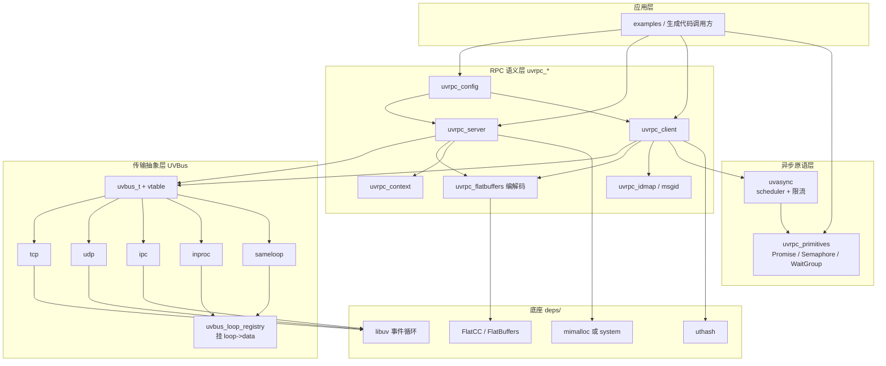

# System architecture

## Overview

自上而下单向依赖的分层结构。**RPC 语义层不接触传输细节，传输层不理解 RPC 帧** —— 这条边界是 `uvbus` 独立成层的全部理由。

| 层 | 职责 | 关键代码 |
|---|---|---|
| 应用层 | 用户 handler、响应回调、生成代码的调用方 | `examples/`、`generated/`（构建期生成，勿手改） |
| RPC 语义层 `uvrpc_*` | config / server / client / context / msgid / idmap / FlatBuffers 编解码 / 错误码 / 重试 | `src/uvrpc_*.c`、`include/uvrpc.h` |
| 异步原语层 | Promise、Semaphore、WaitGroup、`all/race/allSettled` 组合子；`uvasync` 调度器与信号量限流 | `src/uvrpc_primitives.c`、`src/uvasync.c`、`include/uvrpc_primitives.h`、`include/uvasync.h` |
| 传输抽象层 **UVBus** | `uvbus_t` + vtable：`listen / connect / send / send_to / broadcast / disconnect / free`；纯字节传输 | `src/uvbus.c`、`include/uvbus.h`、`include/uvbus_config.h` |
| 传输实现 | 五个平级驱动，同一份 vtable 契约 | `src/uvbus_transport_{tcp,udp,ipc,inproc,sameloop}.c` |
| 底座 | 事件循环、序列化、分配器 | `deps/` 下 vendored git submodules：libuv、flatcc、mimalloc、uthash、gtest |

另有两条横向支撑：**codegen**（`tools/uvrpcc.py` + `tools/templates/*.j2`，从 `schema/*.fbs` 生成 stub/client/broadcast 代码）与**帧格式**（`schema/rpc.fbs` 的单一 `RpcFrame`，见 [[minimal-rpcframe-schema]]）。

## Module graph

**职责边界**（`docs/architecture/`）：UVBus 只搬字节，不碰 RPC 协议与序列化；uvrpc 只管 msgid 匹配、方法路由、回调生命周期，不感知底下是哪种 socket。新增传输只改 uvbus 层，新增 RPC 语义只改 uvrpc 层。

## Constraints

硬约束，改动前必须先过这几条：

1. **Loop 注入**：库**从不**调用 `uv_run` / `uv_stop` / `uv_loop_close`，只接受 `uvrpc_config_set_loop()` 注入的 `uv_loop_t*`。
2. **`loop->data` 被 INPROC / SAMELOOP 占用**：per-loop 端点注册表挂在 `loop->data` 上，带 magic tag + 引用计数（`src/uvbus_loop_registry.h`）。用户若自己塞了非框架指针，注册表不可用并打日志，框架不会覆盖。因此使用这两种传输时，栈上 loop 必须 `uv_loop_t loop = {0};` 零初始化再 `uv_loop_init` —— libuv 会跨 `uv_loop_init` 保留 `loop->data`。这条是对早期"框架不占用 loop->data"承诺的**反转**，详见 [[loop-data-registry-over-global-hash]]。TCP/UDP/IPC 路径则承诺绝不触碰 `loop->data`。
3. **C99 only**：`CMAKE_C_STANDARD 99`，源码里不得出现 `_Static_assert` / `_Generic` / `_Atomic` / `<stdatomic.h>`（测试可用 C++/GTest）。
4. **零 file-scope 可变全局**：system/mimalloc 构建下 `src/` 必须 0 个（唯一例外 `g_custom_allocator` 被 `#if` 编译掉）。分配器分发走**编译期** `#if UVRPC_DEFAULT_ALLOCATOR`，不是运行期开关。
5. **零锁零 atomics**：单线程模型下不得引入 `pthread_mutex` / rwlock / 自旋锁 / `UVRPC_ATOMIC_*`（这些宏已在 `ecff4de` 删除，改回普通 `++/--`）。
6. **Warning-gate**：`src/` 在 `-Wall -Wextra -Wpedantic` 下零警告，CI 直接把警告当失败。
7. **环形缓冲区大小必须是 2 的幂**；错误码统一经 `uvrpc_error_t` 返回并可用 `uvrpc_strerror()` 转文字，不许静默吞掉。
8. **INPROC / SAMELOOP 是 same-loop 专属**：服务端与客户端必须共享同一个 `uv_loop_t*`，靠 per-loop 注册表按名字互相发现。
