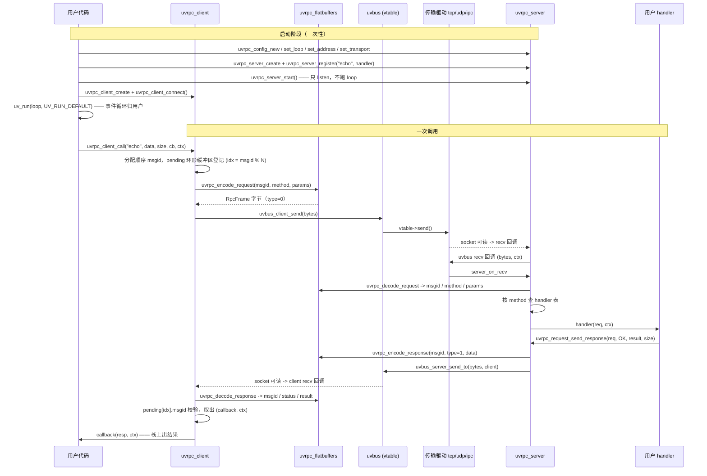

# Key flows

## End-to-end path of a typical request

一次普通 RPC（如 `tcp://127.0.0.1:5555` 上的 `"echo"`）从入口到出口的完整路径。所有步骤都发生在**同一个** `uv_run()` 调用内部的回调里 —— 没有任何一步会阻塞或跨线程。

要点：

- **msgid 是顺序生成的**，所以回调路由用 `msgid % N` 的环形缓冲区 O(1) 直取，而不是哈希表（取舍记在 [[ring-buffer-over-uthash]]）。
- **帧格式极简**：`RpcFrame { msgid:u32, type:u8, method:string, data:[ubyte] }`，`type` 区分 Request / Response / ResponseMore / Error（见 [[minimal-rpcframe-schema]]）。
- **背压即并发控制**：pending 环形缓冲区写满直接返回错误，调用方据此退避 —— 这就是无锁的每客户端并发上限（见 [[pending-buffer-as-concurrency-control]]）。

## Other important flows

### Oneway（fire-and-forget）

`uvrpc_client_call_oneway()` 只编码 + 发送，不登记 pending、不等响应。服务端可能批量攒帧，由 **pump timer** 定期冲刷（`uvrpc_config_set_pump_interval()`）；0ms 间隔 = 立即模式。响应驱动的立即模式是 `d42bfbf` 定型的。

### Stream（一请求多响应）

服务端在 handler 内多次 `uvrpc_response_send_stream(chunk, more)`，最后一帧 `more=0`；客户端靠 `uvrpc_response_is_stream_more()` / `uvrpc_response_is_stream_end()` 判定。`type=ResponseMore` 允许同一 msgid 出现多帧。注意：**框架不做流状态管理**（`75b15ca` 起把 stream management 从 uvrpc 层整个移除），只透传帧标志。

### Broadcast（发布订阅）

`uvbus_broadcast()` 走传输的 `vtable->broadcast`，对 UDP 是带客户端注册的点对点扇出；codegen 有独立的 publisher/subscriber 模板（`tools/templates/broadcast_*.j2`）。

### 失败 / 重连路径

- 连接失败 → `uvrpc_client_connect_with_callback()` 的 status 回调；错误码统一 `uvrpc_error_t`，`uvrpc_strerror()` 转文字。
- 超时/重试 → `uvrpc_client_set_max_retries()`、`uvrpc_client_call_no_retry()` 旁路。
- 连接数上限 → 服务端 `uvrpc_config_set_max_clients()`，触发专用错误码。
- **INPROC/SAMELOOP 拆除顺序**：必须先释放 server 再释放 client 的反序场景由 `test_transport_lifetime` 覆盖，ASan 必须干净。

### 测试里驱动 loop 的正确姿势（踩过坑，别再踩）

- 轮询等待条件：用 `UV_RUN_ONCE`（阻塞到至少一个事件后返回再检查条件），**不要** `UV_RUN_DEFAULT` —— 活连接会让 loop 永远有 reference，`uv_run` 不返回。
- 只是冲刷 close/connect 回调：`UV_RUN_NOWAIT`。
- 跨线程停 loop：`uv_stop()` 唤不醒 epoll_wait，必须用 `uv_async_t` 在目标线程里停。

依据：`8dc1b78`、`b404542`（记在 [[uv-run-once-benchmark-methodology]]）。
