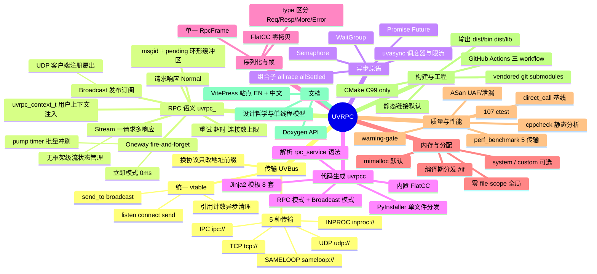

# Feature mindmap

## Feature mindmap

```mermaid
mindmap
  root((UVRPC))
    传输 UVBus
      5 种传输
        TCP tcp://
        UDP udp://
        IPC ipc://
        INPROC inproc://
        SAMELOOP sameloop://
      统一 vtable
        listen connect send
        send_to broadcast
        引用计数异步清理
      换协议只改地址前缀
    RPC 语义 uvrpc_
      请求响应 Normal
      Oneway fire-and-forget
        pump timer 批量冲刷
        立即模式 0ms
      Stream 一请求多响应
        无框架级流状态管理
      Broadcast 发布订阅
        UDP 客户端注册扇出
      msgid + pending 环形缓冲区
      重试 超时 连接数上限
      uvrpc_context_t 用户上下文注入
    异步原语
      Promise Future
      Semaphore
      WaitGroup
      组合子 all race allSettled
      uvasync 调度器与限流
    代码生成 uvrpcc
      解析 rpc_service 语法
      Jinja2 模板 8 套
      内置 FlatCC
      PyInstaller 单文件分发
      RPC 模式 + Broadcast 模式
    序列化与帧
      单一 RpcFrame
      FlatCC 零拷贝
      type 区分 Req/Resp/More/Error
    内存与分配
      mimalloc 默认
      system / custom 可选
      编译期分发 #if
      零 file-scope 全局
    质量与性能
      107 ctest
      ASan UAF/泄漏
      warning-gate
      cppcheck 静态分析
      perf_benchmark 5 传输
      direct_call 基线
    构建与工程
      CMake C99 only
      vendored git submodules
      输出 dist/bin dist/lib
      静态链接默认
      GitHub Actions 三 workflow
    文档
      VitePress 站点 EN + 中文
      Doxygen API
      设计哲学与单线程模型
```

> 说明：这是从 `src/`、`include/`、`tools/`、`tests/`、`.github/` 的实际布局反推的功能全景，不是计划中的功能清单。
