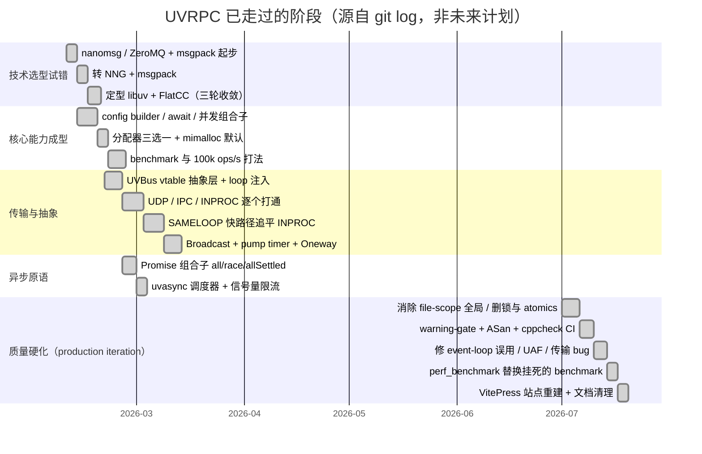

# Roadmap

---
slug: roadmap
title: Roadmap
role: milestones
updated: "2026-09-29T06:42:26"
---

# Roadmap

---
slug: roadmap
title: Roadmap
role: milestones
updated: "2026-09-29T04:54:45"
---

# Roadmap

> ⚠️ **本页可信度说明**：仓库里**没有任何计划文档、milestone、issue 或 git tag**可以证明未来计划。下面"已完成阶段"是从 `git log`（231 commits，2026-02-09 → 2026-07-13）**反推的历史**，有证据；"待定切片"是从 root page `stack` 的 Open items 与代码/文档矛盾处**推导的候选工作**，**不是已确认的计划**，请维护者确认后再当作 roadmap 用。

## 已完成阶段（有 git 证据）

最后一个里程碑提交是 `105a666`（2026-07-13 的 production hardening 合并），证据文档在根目录 `PRODUCTION_ITERATION_2026-07-13.md`：107/107 ctest、ASan 干净、`src/` 零可变全局、warning-clean、5 传输性能数字。

## 切片状态

按"当前最挡路 → 最不挡路"排序，来源是 root page `stack` 的 Open items 与代码/文档矛盾。**1–3 与 6–7 已完成，4 半完成，5 待讨论，8–10 是本轮评审新查出的候选**。

1. ~~**修复构建/分发断点**~~ **✅ 完成并端到端验证（2026-09-28/29）**：范围比原估计更大 —— 另发现 `cmake/Dependencies.cmake` 从未入库、libuv/flatcc gitlink 指向幽灵提交两个隐藏断点。真·新克隆（干净 clone + setup_deps.sh + build.sh）在默认(mimalloc)与 system 两条路径都能构建通过。评审又翻出并修了三处：切片1自报的"零警告"被陈旧 generated/ 掩盖、README/docs 的构建链漏 `setup_deps.sh`、`uvrpc_merged` 的 `ar x` 按 basename 压平丢了 `uv_random`。随后的设计哲学评审删除了一整层 pre-uvbus 死代码（`uv_transport*.c` / `uv_frame.c` / `uvrpc_khash.h`）。记录于 [[build-distribution-breakage]]。
2. ~~**文档与代码对齐**~~ **✅ 完成（2026-09-29）**：`docs/guide/design-philosophy.md`、`docs/architecture/{index,integration}.md`、`docs/guide/benchmark.md`（整页重写）、`docs/guide/single-thread-model.md`、`docs/build-install.md`、`docs/development/{coding-standards,doxygen-examples}.md`、`docs/api/{index,generated-api}.md`、`docs/quick-start.md` 与 `docs/zh/guide/quick-start.md` 全部按代码现状改写；README 与站点/SEO 元数据的性能数字当时统一为 ~4.9 µs / ~205,000 req/s（该基线已在第 11 项被 CI 实测值取代）。`docs/api/generated-api.md` 的两段示例经**真实编译并跑通**（`Add result: 30`），顺带纠正了"把 flatcc 根指针直接当 table 用"这个会读错字段的示例错误。**结构性事实**：`docs/zh/guide/{design-philosophy,api-guide,single-thread-model}.md`、`docs/zh/build-install.md`、`docs/zh/development/{coding-standards,doxygen-examples}.md` 是指向根目录同名文件的符号链接，所以"英文"页面正文本就是中文；要真正分语言，得先把符号链接换成独立文件。
3. ~~**补齐 mimalloc 构建的 CI 覆盖**~~ **✅ 完成（2026-09-28）**：随切片 1 解决 —— CI 新增 `default-allocator` job，所有 job 先跑 `setup_deps.sh`。
4. **发布工程**（剩余部分）：`LICENSE` 已补、`libuvrpc_full.a` 丢符号缺陷已修；`Version` 徽章指向的 `v1.0.0a` release 仍不存在 —— 需打 tag 并在 GitHub 建 release，徽章才名副其实。
5. **未决的架构问题**（需讨论，工期不定）：`loop->data` 占用是"框架抢用户字段"的妥协方案，是否有更干净的挂载点（per-loop hash key，或显式 `uvrpc_registry_t*` 由用户传入）值得重新评估 —— 当前唯一"框架悄悄动了用户可见字段"的地方，见 [[loop-data-registry-over-global-hash]]。
6. ~~**环形缓冲 `generation` 机制**~~ **✅ 完成（2026-09-29）**：按"删除无用"处理 —— `generation` 从 `pending_callback_t` 与 `uvrpc_client` 双双移除，msg-match 成为唯一的槽位校验，陈旧项回收死路径随之消失。见 [[ring-buffer-over-uthash]]。
7. ~~**只写的并发/性能字段**~~ **✅ 完成（2026-09-29）**：`performance_mode` / `batching_*` / `pool_size` / `timeout_ms` / `pump_interval` / `send_pending` 连同其公开 setter、`uvrpc_perf_mode_t` 枚举、`uvbus_config` 的超时字段全部删除；`current_concurrent` 改为在单次与批次两条路径一致记账（此前只在批次递增、却在所有响应里递减，会向负漂移），`max_concurrent` 因此真正约束单次调用。新增 `UVRPCQuotaLiveTest.MaxConcurrentGatesSingleCalls` 锁住该语义。细节与保留/删除清单见 [[pending-buffer-as-concurrency-control]]。
8. ~~**codec 缓冲区与分配器不一致**~~ **✅ 完成（2026-09-29）**：契约定为"**flatcc 拥有 encode 输出，只能 `free()` 释放**"，不给 builder 挂 `uvrpc_alloc` —— flatcc 是 `setup_deps.sh` 预先编译的静态库，挂钩子要么造成 `libflatcc.a ↔ libuvrpc.a` 的循环静态依赖（`uvrpc_merged` 把两者折叠进同一个 `libuvrpc_full.a`，GNU ld 不保证收敛），要么在 `src/uvrpc_flatbuffers.c` 抄一份 40 行的 `flatcc_builder_default_alloc`（随上游失同步）；两条都比现状贵，且会让已生成的 client.c 与仓库例子集体变错。实现：新增 `uvrpc_free_encoded()`（`src/uvrpc_flatbuffers.h`），`uvrpc_client.c`(11 处) 与 `uvrpc_server.c`(6 处) 全部改走它。验证：custom 分配器下每轮往返实测 8 次跨堆释放 → 0；新增 `tests/allocator_ownership_test.c`（只在 custom 构建注册，因为 system/mimalloc 下 `uvrpc_free()` 底层就是 `free()`，看不见这个 bug）与 CI 的 `custom-allocator` job。**顺带发现**：`uv_loop_init()` 保留 `loop->data`（libuv 1.47 `deps/libuv/src/unix/loop.c:30-38`），未零初始化的 `uv_loop_t` 会让 INPROC/SAMELOOP 直接启动失败 —— 见 [[loop-data-registry-over-global-hash]]。
9. ~~**examples/README.md 索引不存在的示例**~~ **✅ 完成（2026-09-29）**：801 行的 README 里有 20+ 处指向不存在的文件或二进制（`complete_example.c`、`tcp_rpc_demo.c`、`broadcast_publisher/subscriber.c`、`broadcast_service_demo.c`、`test_retry.c`…），编号还重复了两轮（20-32 出现两次），并宣称"所有示例都已在主构建系统里"——实际 `CMakeLists.txt` 只注册了 25 个 example target。重写为按真实构建产物编排的分类清单（每个 `./dist/bin/X` 都已用 `ls dist/bin` 校验存在），单列"有源码但无构建目标"的 22 个文件并给出原因（`CMakeLists.txt:297,330-332`：需要额外 schema 生成），广播一节改为指向真实存在的 `uvbus_broadcast()`。顺带修正 `LOG_SERVICE_README.md` 把 `log_logservice_rpc_common.c` 写成 `.c`（生成器实际产出 `.h`）。**新发现的未决项**：`tools/uvrpcc.py` 跑 `schema/log_service.fbs` 会崩（jinja `UndefinedError: 'rpc_data'`，`tools/templates/rpc_common.c.j2:61`），即日志服务示例那条手动编译路径今天走不通 —— 见 [[uvrpc-tech-stack-lineage]] 的 timeline。
10. ~~**benchmark 的 UDP 语义**~~ **✅ 完成（2026-09-29）**：选了"如实标注"而不是加重传机制 —— 重传会让被测的东西不再是"一次往返"，也等于给测量工具塞了一套重试策略。`perf_benchmark` 在跑 udp 前往 stderr 打印：丢包表现为运行以 `measure stalled` 中止，不是吞吐下降；参考表 7 处 UDP 行统一标注"仅本机 loopback"，中英文两份 benchmark 指南各加一段解释。理由详见 [[uv-run-once-benchmark-methodology]]。

**明确不做**（依据 root page `background` 的 Non-goals）：多线程并发模型、跨语言绑定、大 payload 传输通道。
