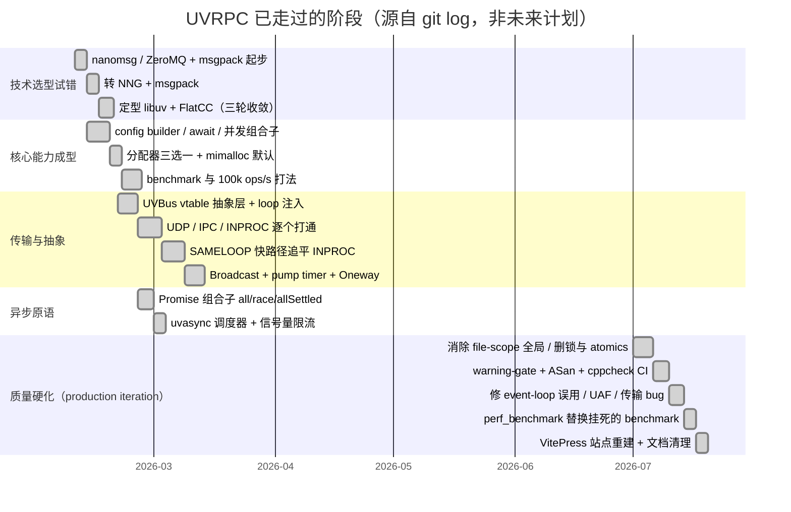

# Roadmap

> ⚠️ **本页可信度说明**：仓库里**没有任何计划文档、milestone、issue 或 git tag**可以证明未来计划。下面"已完成阶段"是从 `git log`（231 commits，2026-02-09 → 2026-07-13）**反推的历史**，有证据；"待定切片"是从 root page `stack` 的 Open items 与代码/文档矛盾处**推导的候选工作**，**不是已确认的计划**，请维护者确认后再当作 roadmap 用。

## 已完成阶段（有 git 证据）

最后一个里程碑提交是 `105a666`（2026-07-13 的 production hardening 合并），证据文档在根目录 `PRODUCTION_ITERATION_2026-07-13.md`：107/107 ctest、ASan 干净、`src/` 零可变全局、warning-clean、5 传输性能数字。

## 待定切片（切片 1 已完成；其余**候选，待确认**）

以下按"当前最挡路 → 最不挡路"排序，全部来自 root page `stack` Open items 与代码/文档矛盾，**尚未经维护者确认**：

1. ~~**修复构建/分发断点**~~ **✅ 已完成并端到端验证（2026-09-28/29）**：范围比原估计更大——另发现 `cmake/Dependencies.cmake` 从未入库、libuv/flatcc gitlink 指向幽灵提交两个隐藏断点。修复与验证记录于 [[build-distribution-breakage]]。**真·新克隆**（干净 clone + setup_deps.sh + build.sh）默认(mimalloc)与 system 两条路径均 107/107 ctest 通过。评审这一版又翻出并修复三处：切片1自报的「零警告」被陈旧 generated/ 掩盖（CI gate 实为 exit 1）、README/docs 的克隆→构建命令仍漏 setup_deps.sh、uvrpc_merged 的 ar x 按 basename 压平丢了 uv_random。随后的设计哲学评审（见 [[zero-threads-locks-globals]]）又查出并删除了一整层 pre-uvbus 死代码：`src/uv_transport.c` + `src/uv_transport_tcp.c` + `include/uv_transport.h`、`src/uv_frame.c` + `include/uv_frame.h`、`src/uvrpc_khash.h`（三者皆无现役引用、不被任何 CMakeLists 收录）。
2. **文档与代码对齐**（约 3 天）：`docs/guide/design-philosophy.md` 关于 `loop->data` 与 INPROC 全局变量的段落已被 [[loop-data-registry-over-global-hash]] 反转，需要更新；同步 `docs/architecture/` 里"INPROC 用锁"的旧表述。评审再确认一处同源陈旧：`design-philosophy.md:144-153` 仍称 INPROC 用全局端点表 `g_endpoint_list`，而代码里该符号已不存在（改为 `inproc_find_endpoint(uvbus_loop_registry_t* reg, …)`，走 per-loop registry）。另：`docs/doxygen/`（579 个已提交的生成 HTML）仍在描述刚删除的死层，需重生成。
3. ~~**补齐 mimalloc 构建的 CI 覆盖**~~ **✅ 已完成（2026-09-28）**：随切片 1 一并解决 —— CI 新增 `default-allocator` job（不传 `UVRPC_ALLOCATOR_DEFAULT`，即走 mimalloc），且所有 job 先跑 `setup_deps.sh`，根因（mimalloc 子模块在 CI 不可用）已消除。
4. **发布工程**（剩余部分）：`LICENSE` 已补（切片 1）、`libuvrpc_full.a` 丢符号缺陷已修（评审 `dc69b3b`）、`Version` 徽章指向的 `v1.0.0a` release 仍不存在 —— 还需打 tag 并在 GitHub 建 release，徽章才名副其实。
5. **未决的架构问题**（需讨论，工期不定）：`loop->data` 占用是"框架抢用户字段"的妥协方案，是否有更干净的挂载点（如 per-loop hash key、或显式 `uvrpc_registry_t*` 由用户传入）值得重新评估 —— 这是当前架构里唯一一处"框架悄悄动了公共字段"的地方。
6. **补上或删掉客户端环形缓冲的 `generation` 机制**（约半天）：`client->generation` 全库只被初始化为 0、从未递增，导致 msgid 回绕后的陈旧项回收分支成为死路径。细节见 [[pending-buffer-as-concurrency-control]]。

**明确不是当前方向**（依据 root page `background` 的 Non-goals）：多线程并发模型、跨语言绑定、大块数据传输通道。
