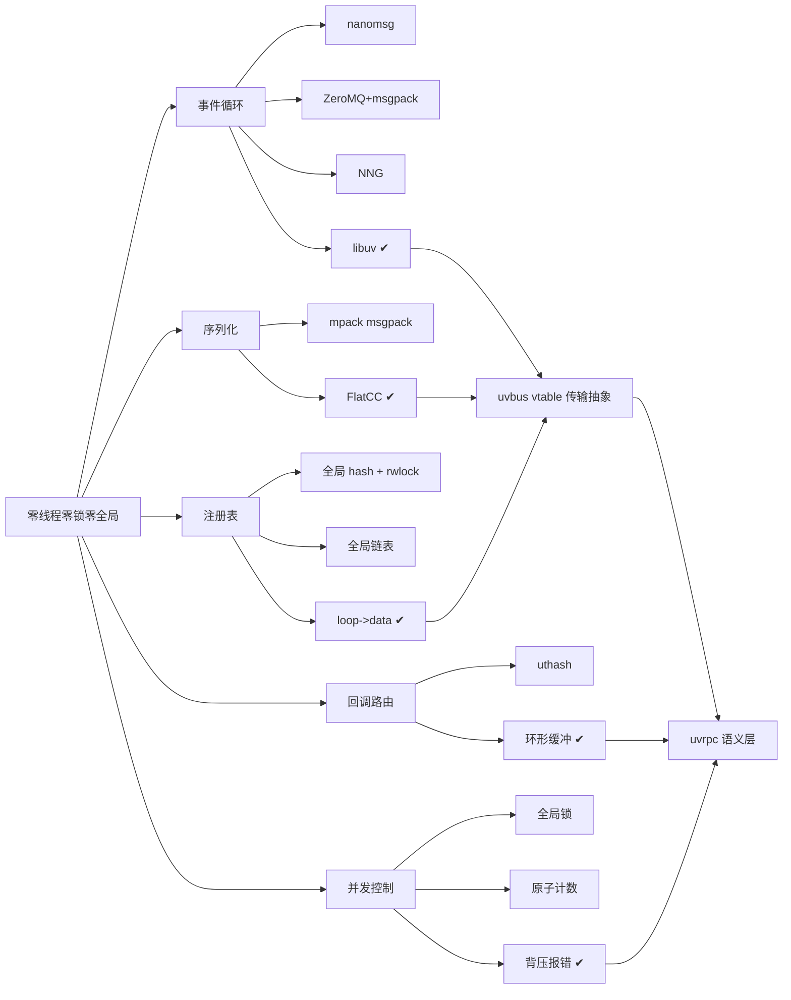

# Tech stack

---
slug: stack
title: Tech stack
role: tech-stack choices
updated: "2026-09-29T06:42:00"
---

# Tech stack

---
slug: stack
title: Tech stack
role: tech-stack choices
updated: "2026-09-29T06:41:51"
---

# Tech stack

---
slug: stack
title: Tech stack
role: tech-stack choices
updated: "2026-09-29T04:55:16"
---

# Tech stack

## Technology choices

| domain | candidates | decision | rationale |
|---|---|---|---|
| 事件循环 / I/O | nanomsg → ZeroMQ(uvzmq) → NNG task 线程 → **libuv 原生** | **libuv** | 前三者都自带线程模型，与零线程铁律冲突；libuv 让全部 I/O 落在单个 loop 回调里 |
| 序列化 | msgpack(mpack) → **FlatCC (FlatBuffers)** | **FlatCC** | 零拷贝反序列化、C 原生、强类型；替代 msgpack 后仍保留"直接访问原始字节"的 handler 语义 |
| 传输实现 | libuv socket（`uv_tcp`/`uv_udp`/`uv_pipe`）直驱 | **5 个平级 vtable 驱动**：tcp / udp / ipc / inproc / sameloop | 同一份 `uvbus` 契约，换协议只改地址前缀；SAMELOOP 是为追平 INPROC 延迟单独做的 vtable 快路径 |
| 端点注册表 | 全局 hash + `pthread_rwlock` → 全局链表 → **`loop->data` per-loop registry** | **per-loop registry**（magic tag + 引用计数） | 删掉唯一的锁违规与全局状态；单线程模型下 per-loop 天然无竞争 |
| 客户端回调路由 | uthash → **环形缓冲数组** | **环形缓冲区**，`idx = msgid & (N-1)` | msgid 顺序生成使其成立：定长指针数组（每槽 8B）+ 24B 条目、位与代替取模、无哈希桶。~~24B vs 80B/条目、省 83%~~ 曾是错的（条目一度是 208B），2026-09-29 裁掉死字段后回到 24B，见 [[ring-buffer-over-uthash]] |
| 并发控制 | 全局锁 / 原子计数 → **fail-fast 三层拒绝** | **背压式无锁限流** | 配额（`max_concurrent`，单次与批次都检查）、槽位（`CALLBACK_LIMIT`）、传输（`BUFFER_FULL`）三层解耦；满即返回错误，调用方退避。见 [[pending-buffer-as-concurrency-control]] |
| 可调参数面 | 曾有 performance_mode / pool_size / timeout_ms / pump_interval / batching_* | **只留真实生效的四个**：max_concurrent、max_pending_callbacks、max_clients、msgid_offset | 2026-09-29 把只写不读的开关连同 setter 全删：一个不生效的旋钮比没有旋钮更糟，它让用户以为自己在调优 |
| 内存分配器 | system / mimalloc / custom | **mimalloc 默认**（`-DUVRPC_ALLOCATOR_DEFAULT=system` 可切） | 分发走**编译期 `#if UVRPC_DEFAULT_ALLOCATOR`**，不占运行期全局变量。注意 flatcc 缓冲区仍走 flatcc 自己的分配器（见 Open items #8） |
| 构建系统 | Makefile → **CMake** | **CMake ≥ 3.15，`CMAKE_C_STANDARD 99`** | 统一目标、schema→flatcc 自定义命令、输出固定到 `dist/bin` `dist/lib`；`uvrpc_merged` 把 libuv/flatcc/mimalloc 打成单一静态库 |
| 单元测试 | 自写 assert → **GTest (C++)** | **GTest** + 独立 C 集成/e2e 测试 | 库本体保持 C99，测试可以用 C++ 拿到参数化与断言能力 |
| 代码生成 | 手写 stub → **Python + Jinja2 + 内置 FlatCC** | **`tools/uvrpcc.py`（`uvrpcc`）** | DSL = FlatBuffers table + `rpc_service Name { M(Req):Res; }`；每服务产出 api.h / server_stub.c / client.c / rpc_common.{h,c}，句柄仍是通用 `uvrpc_server_t`/`uvrpc_client_t`，不做不透明包装 |
| 依赖分发 | 系统包 → **vendored git submodules** | **`.gitmodules` 5 项**：libuv、flatcc、mimalloc、uthash、gtest | 可复现构建；CI 另外 apt `libuv1-dev`，flatcc 无系统包所以必须源码构建 |
| 文档 | 纯 Markdown → Markdown + Doxygen + **VitePress** | **VitePress 站点**（EN + `/zh/`），Doxygen 按需本地生成 | GitHub Pages 部署，`deploy-docs.yml` 用 `npm ci`。`/zh/` 多数页面是指向根目录同名文件的符号链接，故"英文"页面正文实为中文。生成物一律不入库（`docs/node_modules`、`docs/doxygen` 已取消跟踪） |
| CI | 无 → **GitHub Actions 3 workflow** | `ci.yml`（5 job）、`benchmark.yml`、`deploy-docs.yml` | warning-gate + ASan + ctest + cppcheck + 性能回归一起卡住 |
| 打包元数据 | — | `pyproject.toml`（setuptools + `[tool.uv]`） | 只为分发 Python 侧 codegen 工具，库本身是 C 静态库 |

## Decision mindmap

完整决策脉络见 [[uvrpc-tech-stack-lineage]]、[[uvbus-transport-abstraction]]、[[loop-data-registry-over-global-hash]]、[[ring-buffer-over-uthash]]、[[pending-buffer-as-concurrency-control]]、[[zero-threads-locks-globals]]。

## Open items

构建/分发一致性问题于 **2026-09-28 切片 1** 处理完毕，根因与修复契约见 [[build-distribution-breakage]]：

1. ~~`pyproject.toml` console entry 失效~~ —— **已修**：`uvrpc-gen = "uvrpcc:main"`，jinja2 转硬依赖，模板/flatcc 增加安装态回退路径。
2. ~~子模块未初始化 / `deps/mimalloc` 缺失~~ —— **已修**：mimalloc gitlink 恢复至 `8ff03b63`；libuv/flatcc 的旧 gitlink 指向上游不存在的幽灵提交，已重新 pin 到 v1.47.0 / v0.6.1。
3. ~~文档引用的脚本不存在~~ —— **已恢复**：`scripts/setup_deps.sh`（重写，vendored 产物统一 -fPIC）、`build.sh`、`tools/GENERATOR_QUICK.md`、`LICENSE`（MIT，署名沿用 pyproject，待维护者确认）。
4. ~~CI 与默认构建配置不一致~~ —— **已修**：CI 全 job 先跑 setup_deps.sh，并新增 default-allocator(mimalloc) 构建 job。`cmake/Dependencies.cmake` 此前从未入库（.gitignore 裸 `*.cmake` 规则），已补例外并提交。
5. **无 git tag**（未处理，属发布工程切片）—— README 标注 `v1.0.0a`，但仓库 `git tag` 仍为空。
6. ~~根目录残留 5 个已提交二进制~~ —— **已删**（`scenario_1..5_*`，并加 gitignore 规则）。
7. ~~**文档与代码在 `loop->data` 上互相矛盾**~~ —— **已修（2026-09-29 切片 2）**：设计哲学、架构、单线程模型、构建安装、快速开始、生成式 API 六组页面按 [[loop-data-registry-over-global-hash]] 的现状改写。
8. ~~codec 缓冲区与分配器不一致~~ —— **已修（2026-09-29）**：契约定为"flatcc 拥有 `uvrpc_encode_*()` 的输出，只能 `free()` 释放"，新增 `uvrpc_free_encoded()` 统一 17 处释放点；`tests/allocator_ownership_test.c` + CI `custom-allocator` job 守住这条边界。理由见 [[minimal-rpcframe-schema]]。
9. ~~**文档站点无法从干净克隆构建**~~ —— **已修（2026-09-29）**：`docs/node_modules` 从版本控制移除（其 `dist/` 载荷从未被提交），`.gitignore` 既有规则随之生效；`docs/doxygen/`（579 个陈旧 HTML）一并删除并 ignore，`docs/Doxyfile` 保留供按需生成。
10. ~~examples/README.md 索引不存在的示例~~ —— **已修（2026-09-29）**：按真实构建产物重写为分类清单，22 个无构建目标的源文件单列并注明原因。
11. ~~**性能基线取自开发机而非 CI**~~ —— **已修（2026-09-29）**： 旧表记的 ~4.9 µs / ~205,000 req/s 比同一构建的真实值差约一倍，且扩散到 9 个文件。现全部改用 `Benchmark` 工作流在 CI runner 上的实测值，测量前提见 [[uv-run-once-benchmark-methodology]]。
12. ~~benchmark 的 UDP 语义~~ —— **已修（2026-09-29）**：不加重传，改为如实标注：跑 udp 时往 stderr 打印丢包会中止运行而非降低吞吐，参考表 7 处 UDP 行标注"仅本机 loopback"。
13. **`tools/uvrpcc.py` 的生成产物**（部分修复，2026-09-29）—— 生成器不再崩、类型名按 flatcc 0.6 的命名空间规则正确生成，`log_service.fbs` 三个源文件编译 0 error；但 `examples/log_service_demo.c` 自身落后于库 API（`uvrpc_request_send_response` 现返回 void），该示例仍编译不过。
14. **`loop->data` 作为注册表挂载点**（未处理，需讨论）—— 实现就是占用 libuv 的公开用户字段，用 magic 守卫拒绝冲突；这与"UVRPC 不占用 `loop->data`"的说法矛盾，且要求调用方零初始化 loop。是否换挂载点待议。
