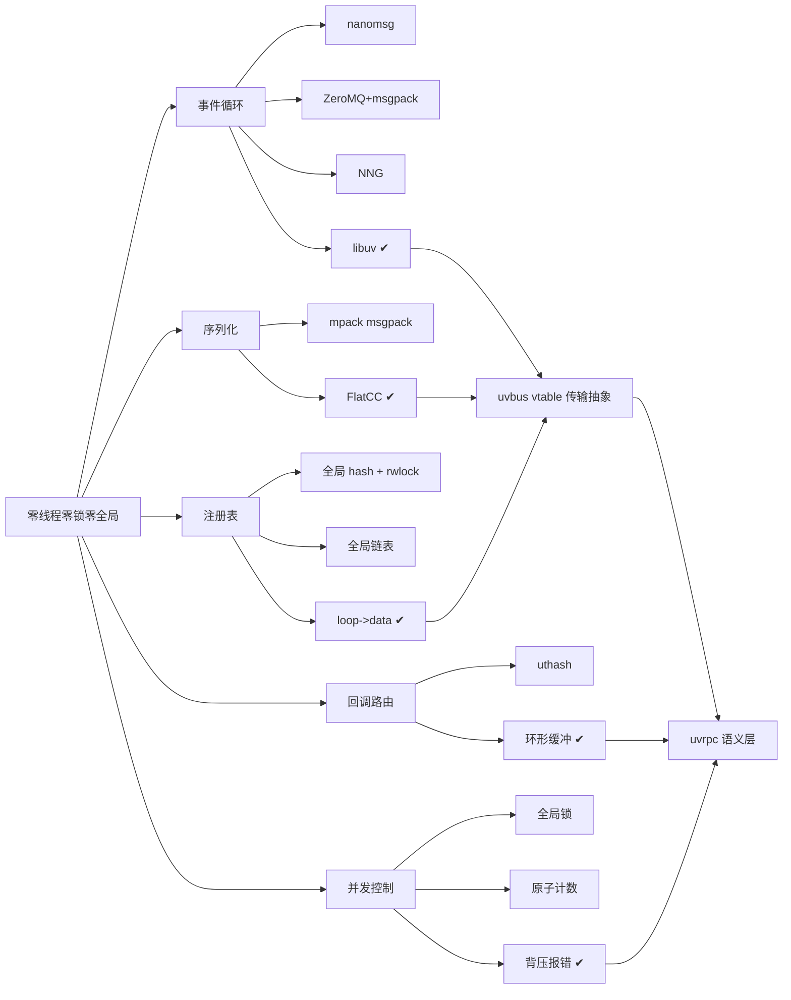

# Tech stack

## Technology choices

| domain | candidates | decision | rationale |
|---|---|---|---|
| 事件循环 / I/O | nanomsg → ZeroMQ(uvzmq) → NNG task 线程 → **libuv 原生** | **libuv** | 前三者都自带线程模型，与零线程铁律冲突；libuv 让全部 I/O 落在单个 loop 回调里 |
| 序列化 | msgpack(mpack) → **FlatCC (FlatBuffers)** | **FlatCC** | 零拷贝反序列化、C 原生、强类型；替代 msgpack 后仍保留"直接访问原始字节"的 handler 语义 |
| 传输实现 | libuv socket（`uv_tcp`/`uv_udp`/`uv_pipe`）直驱 | **5 个平级 vtable 驱动**：tcp / udp / ipc / inproc / sameloop | 同一份 `uvbus` 契约，换协议只改地址前缀；SAMELOOP 是为追平 INPROC 延迟单独做的 vtable 快路径 |
| 端点注册表 | 全局 hash + `pthread_rwlock` → 全局链表 → **`loop->data` per-loop registry** | **per-loop registry**（magic tag + 引用计数） | 删掉唯一的锁违规与全局状态；单线程模型下 per-loop 天然无竞争 |
| 客户端回调路由 | uthash → **环形缓冲数组** | **环形缓冲区**，`idx = msgid % N` | msgid 顺序生成使其成立：24B vs 80B/条目（省 83%）、缓存友好、无指针跳转 |
| 并发控制 | 全局锁 / 原子计数 → **pending 缓冲区写满即报错** | **背压式无锁限流** | 每客户端独立 pending 计数，返回错误让调用方退避；零共享状态 |
| 内存分配器 | system / mimalloc / custom | **mimalloc 默认**（`-DUVRPC_ALLOCATOR_DEFAULT=system` 可切） | 分发走**编译期 `#if UVRPC_DEFAULT_ALLOCATOR`**，不占运行期全局变量 |
| 构建系统 | Makefile → **CMake** | **CMake ≥ 3.15，`CMAKE_C_STANDARD 99`** | 统一目标、schema→flatcc 自定义命令、输出固定到 `dist/bin` `dist/lib`；`uvrpc_merged` 把 libuv/flatcc/mimalloc 打成单一静态库 |
| 单元测试 | 自写 assert → **GTest (C++)** | **GTest** + 独立 C 集成/e2e 测试 | 库本体保持 C99，测试可以用 C++ 拿到参数化与断言能力 |
| 代码生成 | 手写 stub → **Python + Jinja2 + 内置 FlatCC** | **`tools/uvrpcc.py`（`uvrpcc`）** | 8 套 Jinja2 模板覆盖 RPC 与 broadcast 两种模式；PyInstaller 打单文件分发 |
| 依赖分发 | 系统包 → **vendored git submodules** | **`.gitmodules` 5 项**：libuv、flatcc、mimalloc、uthash、gtest | 可复现构建；但 CI 改用 `apt libuv1-dev`（见 Open items） |
| 文档 | 纯 Markdown → Markdown + Doxygen + **VitePress** | **VitePress 站点**（EN + `/zh/`），Doxygen 出 API | GitHub Pages 部署，`deploy-docs.yml` |
| CI | 无 → **GitHub Actions 3 workflow** | `ci.yml`（5 job）、`benchmark.yml`、`deploy-docs.yml` | warning-gate + ASan + ctest + cppcheck + 性能回归一起卡住 |
| 打包元数据 | — | `pyproject.toml`（setuptools + `[tool.uv]`） | 只为分发 Python 侧 codegen 工具，库本身是 C 静态库 |

## Decision mindmap

完整决策脉络见 [[uvrpc-tech-stack-lineage]]、[[uvbus-transport-abstraction]]、[[loop-data-registry-over-global-hash]]、[[ring-buffer-over-uthash]]、[[pending-buffer-as-concurrency-control]]、[[zero-threads-locks-globals]]。

## Open items

构建/分发一致性问题于 **2026-09-28 切片 1** 处理完毕，根因与修复契约见 [[build-distribution-breakage]]：

1. ~~`pyproject.toml` console entry 失效~~ —— **已修**：`uvrpc-gen = "uvrpcc:main"`，jinja2 转硬依赖，模板/flatcc 增加安装态回退路径。
2. ~~子模块未初始化 / `deps/mimalloc` 缺失~~ —— **已修**：mimalloc gitlink 恢复至 `8ff03b63`；libuv/flatcc 的旧 gitlink 指向上游不存在的幽灵提交，已重新 pin 到 v1.47.0 / v0.6.1。
3. ~~文档引用的脚本不存在~~ —— **已恢复**：`scripts/setup_deps.sh`（重写，vendored 产物统一 -fPIC）、`build.sh`、`tools/GENERATOR_QUICK.md`、`LICENSE`（MIT，署名沿用 pyproject，待维护者确认）。
4. ~~CI 与默认构建配置不一致~~ —— **已修**：CI 全 job 先跑 setup_deps.sh，并新增 default-allocator(mimalloc) 构建 job。`cmake/Dependencies.cmake` 此前从未入库（.gitignore 裸 `*.cmake` 规则），已补例外并提交——这是切片 1 发现的**最严重隐藏断点**。
5. **无 git tag**（未处理，属发布工程切片）—— README 标注 `v1.0.0a`，但仓库 `git tag` 仍为空。
6. ~~根目录残留 5 个已提交二进制~~ —— **已删**（`scenario_1..5_*`，并加 gitignore 规则）。
7. **文档与代码在 `loop->data` 上互相矛盾**（未处理，切片 2）—— `docs/guide/design-philosophy.md` 仍称"UVRPC 不占用 `loop->data`"，与 `src/uvbus_loop_registry.h` 相反。
