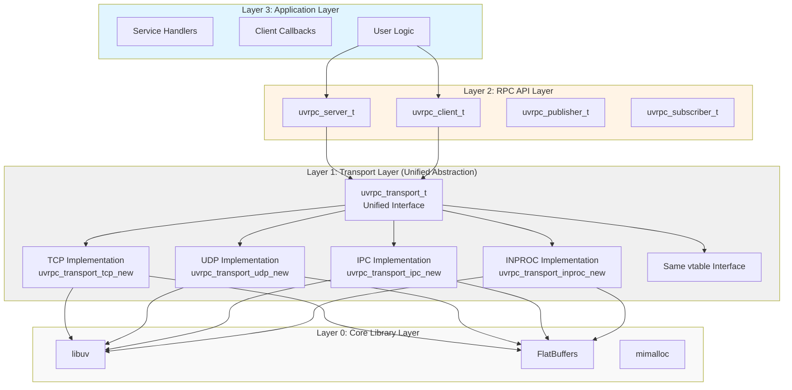

# Design Philosophy

## Overview

UVRPC (Ultra-Fast RPC) is a high-performance RPC framework designed for modern applications. It follows a minimalistic design philosophy with zero threads, zero locks, and zero global variables.

## Core Principles

### 1. Zero Threads, Zero Locks, Zero Global Variables

UVRPC achieves high performance through:

- **Single-threaded event loop**: Uses libuv's event loop for all I/O operations
- **Lock-free design**: No locks required due to single-threaded architecture
- **No global variables**: All state is encapsulated in context objects

This approach eliminates:
- Thread synchronization overhead
- Lock contention
- Context switching costs
- Global state management complexity

### 2. Minimal API Surface

The API is intentionally small and focused:

- Only 3 core server functions: `uvrpc_server_create()`, `uvrpc_server_register()`, `uvrpc_server_free()`
- Only 3 core client functions: `uvrpc_client_create()`, `uvrpc_client_call()`, `uvrpc_client_free()`
- Simple, intuitive naming conventions

### 3. Zero-Copy Design

UVRPC minimizes data copying through:

- Direct buffer passing between layers
- Reference counting for shared buffers
- Efficient serialization with FlatBuffers

### 4. Transport Agnostic

The framework abstracts transport mechanisms:

- TCP, UDP, IPC, and INPROC transports
- Uniform API across all transports
- Easy to add new transports

## Architecture Design

### Layered Architecture



### Unified Transport Abstraction

**Transport Interface (uvrpc_transport_vtable_t)**:
```c
struct uvrpc_transport_vtable {
    /* Server operations */
    int (*listen)(void* impl, const char* address,
                  uvrpc_recv_callback_t recv_cb, void* ctx);
    
    /* Client operations */
    int (*connect)(void* impl, const char* address,
                   uvrpc_connect_callback_t connect_cb,
                   uvrpc_recv_callback_t recv_cb, void* ctx);
    void (*disconnect)(void* impl);
    
    /* Send operations */
    void (*send)(void* impl, const uint8_t* data, size_t size);
    void (*send_to)(void* impl, const uint8_t* data, size_t size, void* target);
    
    /* Cleanup */
    void (*free)(void* impl);
};
```

All transport implementations share the same vtable interface, ensuring:
- Uniform API across transports
- Easy transport switching
- Extensibility for new transports

## Memory Management

### Allocator Abstraction

UVRPC provides a unified allocator interface:

```c
typedef void* (*uvrpc_alloc_fn)(size_t size);
typedef void (*uvrpc_free_fn)(void* ptr);

struct uvrpc_allocator {
    uvrpc_alloc_fn alloc;
    uvrpc_free_fn free;
    void* user_data;
};
```

Benefits:
- Custom memory allocators (mimalloc, jemalloc, etc.)
- Memory tracking and debugging
- Performance optimization
- Testing and benchmarking

### Zero-Copy Optimization

The framework minimizes copying through:

1. **Buffer reuse**: Buffers are reused across requests
2. **Reference counting**: Shared buffers use reference counting
3. **Direct serialization**: FlatBuffers serializes directly to output buffers

## Error Handling

### Error Types

UVRPC uses a comprehensive error system:

```c
typedef enum {
    UVRPC_OK = 0,
    UVRPC_ERROR_INVALID_PARAM,
    UVRPC_ERROR_OUT_OF_MEMORY,
    UVRPC_ERROR_CONNECTION_FAILED,
    UVRPC_ERROR_TIMEOUT,
    UVRPC_ERROR_PROTOCOL_ERROR,
    /* ... more error codes */
} uvrpc_error_t;
```

### Error Handling Pattern

All API functions follow the pattern:

```c
uvrpc_error_t uvrpc_function(params, ...) {
    if (!validate_params(params)) {
        return UVRPC_ERROR_INVALID_PARAM;
    }
    /* ... implementation ... */
    return UVRPC_OK;
}
```

## Performance Optimization

### Batch Processing

UVRPC processes requests in batches:

- Default batch size: 1000 requests
- Reduces per-request overhead
- Improves cache locality

### Connection Pooling

For client-side operations:

- Connection reuse
- Minimal connection overhead
- Automatic connection management

### Serialization Optimization

FlatBuffers provides:

- Zero-copy deserialization
- Direct access to data
- Binary protocol efficiency

## INPROC Transport Architecture

### Zero-Copy INPROC Implementation

The INPROC transport uses a shared memory architecture for zero-copy communication:

```mermaid
graph TB
    subgraph Server["Server Process"]
        subgraph S1["uvrpc_server_t"]
            S1a[transport: uvrpc_transport_t]
            S1b[impl: uvrpc_inproc_transport_t]
            S1c[endpoint: inproc_endpoint_t]
            S1c1[name: "test_endpoint"]
            S1c2[server_transport: ← Points to self]
            S1c3[clients: [client1, client2, ...]]
            S1c4[client_count: 2]
            
            S1a --> S1b
            S1b --> S1c
            S1c --> S1c1
            S1c --> S1c2
            S1c --> S1c3
            S1c --> S1c4
        end
        
        subgraph S2["inproc_endpoint_t"]
            S2a[Global endpoint registry g_endpoint_list]
            S2b[Linked list structure, supports multiple endpoints]
            
            S2a --> S2b
        end
        
        subgraph S3["uvrpc_client_t"]
            S3a[transport: uvrpc_transport_t]
            S3b[impl: uvrpc_inproc_transport_t]
            S3c[recv_cb: client_recv_callback]
            S3d[endpoint: → Points to same endpoint]
            
            S3a --> S3b
            S3b --> S3c
            S3b --> S3d
        end
        
        S1 -->|Direct call| S2
        S3 -->|Direct call| S2
    end
    
    style Server fill:#e1f5ff
```

#### Endpoint Management

**Endpoint Structure**:
```c
typedef struct inproc_endpoint {
    char name[256];                    // Endpoint name
    uvrpc_inproc_transport_t* server_transport;  // Server transport
    uvrpc_inproc_transport_t** clients;          // Connected clients
    size_t client_count;               // Number of clients
    size_t client_capacity;            // Client array capacity
    struct inproc_endpoint* next;      // Linked list next
} inproc_endpoint_t;
```

#### Zero-Copy Data Flow

1. **Server → Client**: Direct pointer passing, no copying
2. **Client → Server**: Direct pointer passing, no copying
3. **Buffer Lifecycle**: Reference counting, automatic cleanup

Key advantages:
- Zero network overhead
- Zero serialization overhead
- Zero copy overhead
- Same performance as function calls

## Extensibility

### Adding New Transports

To add a new transport:

1. Implement the `uvrpc_transport_vtable_t` interface
2. Create transport factory function
3. Register with UVRPC

Example:
```c
uvrpc_transport_t* my_transport_new(const char* config) {
    /* ... implementation ... */
    return transport;
}
```

### Custom Serializers

UVRPC supports custom serialization:

- Implement serialization interface
- Register with UVRPC
- Use with existing transport

## Testing Strategy

### Unit Testing

- Test individual components
- Mock dependencies
- Fast execution

### Integration Testing

- Test component interactions
- Use actual transports
- End-to-end scenarios

### Performance Testing

- Benchmark all transports
- Measure latency and throughput
- Profile memory usage

## Conclusion

UVRPC's design philosophy emphasizes:

- **Simplicity**: Minimal API, easy to understand
- **Performance**: Zero-copy, single-threaded, lock-free
- **Flexibility**: Transport agnostic, extensible
- **Reliability**: Comprehensive error handling

This combination makes UVRPC suitable for:
- High-performance systems
- Microservices architecture
- Real-time applications
- Resource-constrained environments