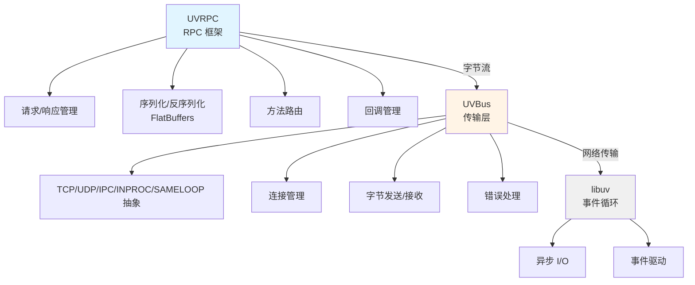

# UVBus 和 UVRPC 架构设计

## 设计原则

### UVRPC 核心哲学
- 极简设计：最小化 API，每个函数只做一件事
- 零线程：所有 I/O 在事件循环中异步执行
- 零锁：单线程模型，无需锁机制
- 零文件作用域可变全局：所有状态通过上下文传递（INPROC/SAMELOOP 走 per-loop 注册表）
- **Loop 注入**：不管理 loop 生命周期，完全由用户控制

### UVBus 定位
- **底层传输抽象**：纯粹的字节传输层
- **无业务逻辑**：不处理 RPC 协议、序列化等
- **极简接口**：connect, send, recv, disconnect
- **Loop 用户管理**：接收用户提供的 loop，不管理其生命周期

## 架构层次



## Loop 注入设计

### 核心原则

UVBus 采用 **Loop 注入** 模式，完全遵循 UVRPC 的设计哲学：

1. **不创建 Loop**：UVBus 不创建任何事件循环
2. **不启动 Loop**：UVBus 不调用 `uv_run()`
3. **不停止 Loop**：UVBus 不调用 `uv_stop()`
4. **不释放 Loop**：UVBus 不调用 `uv_loop_close()` 或 `uv_loop_delete()`

### 用户责任

用户完全控制 loop 的生命周期：

```c
/* 1. 用户创建和初始化 loop */
uv_loop_t loop;
uv_loop_init(&loop);

/* 2. 用户创建 UVBus 实例（注入 loop）——参数经 config，回调也挂在 config 上 */
uvbus_config_t* cfg = uvbus_config_new();
uvbus_config_set_loop(cfg, &loop);
uvbus_config_set_transport(cfg, UVBUS_TRANSPORT_TCP);
uvbus_config_set_address(cfg, "tcp://127.0.0.1:5555");
uvbus_config_set_recv_callback(cfg, on_recv, &server_ctx);
uvbus_t* server = uvbus_server_new(cfg);
uvbus_config_free(cfg);
uvbus_listen(server);

/* 3. 用户启动 loop */
uv_run(&loop, UV_RUN_DEFAULT);

/* 4. 用户停止 loop（可选） */
uv_stop(&loop);

/* 5. 用户清理 loop */
uv_loop_close(&loop);
```

### 多实例支持

Loop 可以在多个实例间共享：

```c
/* 场景：多个服务器 + 一个客户端共享一个 loop */
uv_loop_t loop;
uv_loop_init(&loop);

uvbus_config_t* c1 = uvbus_config_new();
uvbus_config_set_loop(c1, &loop);
uvbus_config_set_transport(c1, UVBUS_TRANSPORT_TCP);
uvbus_config_set_address(c1, "tcp://127.0.0.1:5555");
uvbus_t* server1 = uvbus_server_new(c1);

uvbus_config_t* c2 = uvbus_config_new();           /* 每实例一份 config */
uvbus_config_set_loop(c2, &loop);
uvbus_config_set_transport(c2, UVBUS_TRANSPORT_TCP);
uvbus_config_set_address(c2, "tcp://127.0.0.1:5556");
uvbus_t* server2 = uvbus_server_new(c2);

uvbus_config_t* cc = uvbus_config_new();
uvbus_config_set_loop(cc, &loop);
uvbus_config_set_transport(cc, UVBUS_TRANSPORT_TCP);
uvbus_config_set_address(cc, "tcp://127.0.0.1:5557");
uvbus_t* client = uvbus_client_new(cc);

uvbus_listen(server1);
uvbus_listen(server2);
uvbus_connect(client);

/* 所有实例共享同一个 loop */
uv_run(&loop, UV_RUN_DEFAULT);
```

### INPROC/SAMELOOP：注册表由调用方创建

INPROC 与 SAMELOOP 不在 loop 上保存任何状态。server 与 client 由两份独立 config 创建，
它们通过一个**由调用方创建**的注册表互相找到：

```c
uvbus_loop_registry_t* reg = uvbus_loop_registry_new();

uvrpc_config_set_loop_registry(server_config, reg);
uvrpc_config_set_loop_registry(client_config, reg);

...                                   /* 建 server / client，跑 loop */

uvrpc_client_free(client);
uvrpc_server_free(server);
uvbus_loop_registry_free(reg);
```

需要传给**每一个必须互相看得见的 config**，否则它们属于不同的注册表，也就互相看不见。

TCP/UDP/IPC 不需要注册表，传了会被忽略。INPROC/SAMELOOP 缺少注册表时，transport 创建阶段
直接报错——框架没有任何隐藏的 per-loop 或进程级状态可以退回，所以两个无关的端点不可能"碰巧"
连到一起。

**为什么不用 `loop->data`**：那是 libuv 唯一的 per-loop 用户字段，框架曾经占用它。代价是判断
"这个指针是不是我们的"必须**解引用**它；而 libuv 1.47 的 `uv_loop_init()` 刻意保留该字段
（存下再写回，`deps/libuv/src/unix/loop.c:30-38`），于是 `uv_loop_t loop; uv_loop_init(&loop);`
——libuv 官方文档示范的写法——会把栈上的残留留在那里。实测约**五次里有一次**在读 magic 时段错误，
而不是返回错误。改由调用方传入之后，调用方对自己的 loop 做什么都碰不到它，这一类问题整个消失。

代价是调用方多两行，且要自己管生命周期：注册表被 transport 各自 retain，所以提前释放不会
立刻 use-after-free，但它的桶数组会一起释放——仍应在 transport 释放之后再释放自己的那份。
`tests/loop_registry_test.c` 锁住这些行为。

### 优势

1. **灵活性**：用户完全控制 loop 的行为
2. **可测试性**：易于单元测试和集成测试
3. **可复用性**：loop 可以在多个实例间共享
4. **云原生**：支持容器化和微服务架构
5. **资源控制**：用户决定何时创建/销毁 loop
6. **避免竞争**：用户控制 loop 的线程归属

### 注意事项

1. **Loop 生命周期**：确保在使用 UVBus 期间 loop 仍然有效
2. **线程安全**：loop 必须在其创建的线程中运行
3. **资源清理**：先释放 UVBus 实例，再清理 loop
4. **错误处理**：检查 loop 是否已初始化

### 正确的使用顺序

```c
/* 正确的顺序：所有参数（含回调）都先进 config，实例创建时一次性读走 */
uv_loop_t loop;
uv_loop_init(&loop);                          /* 1. 初始化 loop */
uvbus_config_t* cfg = uvbus_config_new();
uvbus_config_set_loop(cfg, &loop);
uvbus_config_set_transport(cfg, UVBUS_TRANSPORT_INPROC);
uvbus_config_set_address(cfg, "inproc://svc");
uvbus_config_set_recv_callback(cfg, on_recv, NULL);
uvbus_t* bus = uvbus_server_new(cfg);         /* 2. 创建实例 */
uvbus_listen(bus);                            /* 3. 启动监听 */
uv_run(&loop, UV_RUN_DEFAULT);                /* 4. 运行 loop */
uvbus_free(bus);                              /* 5. 释放实例 */
uv_loop_close(&loop);                         /* 6. 清理 loop */
```

## UVBus 接口定义

### 核心概念

```c
/* UVBus 句柄（server 与 client 同一类型） */
typedef struct uvbus uvbus_t;

/* 传输类型 —— 五个平级，见 src/uvbus.c:134 的 create_transport() */
typedef enum {
    UVBUS_TRANSPORT_TCP     = 0,
    UVBUS_TRANSPORT_UDP     = 1,
    UVBUS_TRANSPORT_IPC     = 2,   /* Unix domain socket */
    UVBUS_TRANSPORT_INPROC  = 3,
    UVBUS_TRANSPORT_SAMELOOP = 4   /* 要求 server/client 在同一个 uv_loop_t 实例上 */
} uvbus_transport_type_t;

/* 回调类型（include/uvbus.h:91-121） */
typedef void (*uvbus_recv_callback_t)(const uint8_t* data, size_t size,
                                      void* client_ctx, void* server_ctx);
typedef void (*uvbus_connect_callback_t)(uvbus_error_t status, void* ctx);
typedef void (*uvbus_close_callback_t)(void* ctx);
typedef void (*uvbus_error_callback_t)(uvbus_error_t error_code,
                                       const char* error_msg, void* ctx);
```

注意 `uvbus_recv_callback_t` 的签名：server 侧收包时**同时**拿到 `client_ctx`
（哪个连接发来的）与 `server_ctx`。client 侧只用 `server_ctx` 位（该传输决定其含义）。
早期文档里的三参数版本 `(data, size, ctx)` 不存在。

### 配置对象：唯一的回调挂载点

UVBus **没有** `uvbus_server_set_recv_callback()` 之类的实例级 setter。回调挂在
`uvbus_config_t` 上（`include/uvbus.h:212-252`），在 `uvbus_server_new()` /
`uvbus_client_new()` 时被拷进总线与其传输对象：

```c
uvbus_config_t* uvbus_config_new(void);
void uvbus_config_free(uvbus_config_t* config);
void uvbus_config_set_loop(uvbus_config_t* c, uv_loop_t* loop);
void uvbus_config_set_transport(uvbus_config_t* c, uvbus_transport_type_t t);
void uvbus_config_set_address(uvbus_config_t* c, const char* address);
void uvbus_config_set_recv_callback(uvbus_config_t* c, uvbus_recv_callback_t cb, void* ctx);
void uvbus_config_set_connect_callback(uvbus_config_t* c, uvbus_connect_callback_t cb, void* ctx);
void uvbus_config_set_close_callback(uvbus_config_t* c, uvbus_close_callback_t cb, void* ctx);
void uvbus_config_set_error_callback(uvbus_config_t* c, uvbus_error_callback_t cb, void* ctx);
```

`uvbus_config` 的字段见 `include/uvbus.h:140-152`：`loop`、`transport`、`address`、
四个回调、`recv_ctx`（给 `recv_cb`）与 `callback_ctx`（给 `connect_cb`/`close_cb`/
`error_cb`）。**两个 ctx 是分开的** —— 接收上下文与生命周期上下文不要混用。
总线层也没有超时配置：`timeout_ms` / `enable_timeout` 曾存在于结构里但无人读取，
已随其余只写字段一并删除。

### 服务器 API

```c
uvbus_t*      uvbus_server_new(uvbus_config_t* config);  /* include/uvbus.h:279 */
uvbus_error_t uvbus_listen(uvbus_t* bus);                /* :284 */
void          uvbus_stop(uvbus_t* bus);                  /* :289 */
uvbus_error_t uvbus_send(uvbus_t* bus, const uint8_t* data, size_t size);        /* :294 —— 广播给所有已连接客户端 */
uvbus_error_t uvbus_send_to(uvbus_t* bus, const uint8_t* data, size_t size, void* client); /* :299 */
uvbus_error_t uvbus_broadcast(uvbus_t* bus, const uint8_t* data, size_t size);   /* :313 */
```

`uvbus_server_new()` 接收的是**配置指针**，不是 `(loop, transport, address)` 三参数。
调用方仍可 `uvbus_config_free()` —— 值已被拷走，`address` 是深拷贝
（`src/uvbus.c`）。停止与释放是两步：`uvbus_stop()` 断开会话，`uvbus_free()` 归还对象。

### 客户端 API

```c
uvbus_t*      uvbus_client_new(uvbus_config_t* config);   /* include/uvbus.h:372 */
uvbus_error_t uvbus_connect(uvbus_t* bus);                /* :325 */
uvbus_error_t uvbus_connect_with_callback(uvbus_t* bus,
                    uvbus_connect_callback_t cb, void* ctx); /* :330 —— 覆盖 config 里的 connect_cb */
void          uvbus_disconnect(uvbus_t* bus);             /* :335 */
uvbus_error_t uvbus_client_send(uvbus_t* bus, const uint8_t* data, size_t size); /* :340 */
```

### 两侧通用的访问器与释放

```c
uv_loop_t*             uvbus_get_loop(uvbus_t* bus);            /* include/uvbus.h:405 */
uvbus_transport_type_t uvbus_get_transport_type(uvbus_t* bus);  /* :358 */
const char*            uvbus_get_address(uvbus_t* bus);         /* :363 */
int                    uvbus_is_connected(uvbus_t* bus);        /* :368 */
int                    uvbus_is_server(uvbus_t* bus);           /* :373 */
void                   uvbus_free(uvbus_t* bus);                /* :384 —— server/client 同一个释放函数 */
```

server 与 client 共用一个 `uvbus_t` 类型和一套发送/访问接口；差别只在
`uvbus_server_new` + `uvbus_listen` 对 `uvbus_client_new` + `uvbus_connect`。
这正是传输层 vtable 只有一份的原因：5 个传输驱动实现同一份 7 槽契约
（`include/uvbus.h:129-137`），总线层只见 `void* impl`。

## UVRPC 对 UVBus 的使用

UVRPC 是 UVBus 的一个使用者：RPC 层只负责帧的编解码与路由，**一切字节收发都交给
`uvbus_send()`**。因此换传输不改 RPC 层。下面是真实的接线（内部函数，非公开 API）。

### 服务器侧

```c
/* src/uvrpc_server.c:59 —— 真实签名是 4 参数，client_ctx 标识来源连接 */
static void server_recv_callback(const uint8_t* data, size_t size,
                                 void* client_ctx, void* server_ctx) {
    uvrpc_server_t* server = (uvrpc_server_t*)server_ctx;
    /* 解码 RpcFrame，按 method 找到 handler，构造 uvrpc_request_t 后调用 */
}

/* src/uvrpc_server.c:273-300 —— 创建流程：全部经 uvbus_config_* */
uvbus_config_t* bus_config = uvbus_config_new();
uvbus_config_set_loop(bus_config, config->loop);
uvbus_config_set_transport(bus_config, config->transport);
uvbus_config_set_address(bus_config, server->address);
uvbus_config_set_recv_callback(bus_config, server_recv_callback, server);
server->uvbus = uvbus_server_new(bus_config);
uvbus_config_free(bus_config);      /* 值已被拷走，address 是 uvrpc_strdup 的副本 */
```

handler 的类型是 `typedef void (*uvrpc_handler_t)(uvrpc_request_t* req, void* ctx)`
（`include/uvrpc.h:200`）——回调拿到的是**请求对象**，不是裸的 `(msgid, params, size)`
三元组；msgid、method、payload 都从 `req` 上取。注册表是 uthash 的
`method name → handler` 映射（`src/uvrpc_server.c:174,378,402`），查找前把方法名小写化。

### 客户端侧

```c
/* src/uvrpc_client.c:206 —— 同样是 4 参数签名 */
static void client_recv_callback(const uint8_t* data, size_t size,
                                 void* client_ctx, void* server_ctx);

/* src/uvrpc_client.c:206-240 —— 与服务器对称，另设 connect_callback */
uvbus_config_set_recv_callback(bus_config, client_recv_callback, client);
uvbus_config_set_connect_callback(bus_config, client_connect_callback, client);
client->uvbus = uvbus_client_new(bus_config);
```

响应**不按 `find_call()` 遍历查找**，而是按 msgid 取模直接命中环形缓冲的槽位：
`idx = msgid & (client->max_pending_callbacks - 1)`（`src/uvrpc_client.c:250`）。
容量必须是 2 的幂，这个契约在 `src/uvrpc_config.c:106` 强制校验。

### 编解码与错误码

帧的编解码是**内部**能力，声明在 `src/uvrpc_flatbuffers.h`（不在 `include/` 下）：

```c
int uvrpc_encode_request(uint32_t msgid, const char* method, ...);   /* :16 */
int uvrpc_decode_request(const uint8_t* data, size_t size, ...);      /* :27 */
int uvrpc_decode_response(const uint8_t* data, size_t size, ...);     /* :31 —— 三个出参，没有独立 error 出参 */
```

`uvrpc_decode_response` 只输出 `msgid`、`result`、`result_size`；错误信息在
`uvrpc_response_t` 结构里（`resp.status` / `resp.error_code` / `resp.error_message`，
见 `src/uvrpc_client.c:155-161`）。这些函数一律返回 `uvrpc_error_t` 枚举的**整数值**，
而 `uvrpc_error_t` 的取值见 `include/uvrpc.h:50-67`：`UVRPC_OK=0` 到
`UVRPC_ERROR_MAX_CLIENTS=-16`。**没有 `UVRPC_ERROR_ENCODE`** ——编码失败返回
`UVRPC_ERROR`（`-1`）。发送失败会按原因分层映射成 `UVRPC_ERROR_TRANSPORT_BUSY`
或 `UVRPC_ERROR_TRANSPORT`，见 `src/uvrpc_client.c:517-520`。

## 设计优势

### 1. 职责清晰
- **UVBus**：只负责传输，不关心内容
- **UVRPC**：只负责 RPC 语义，不关心传输细节

### 2. 可测试性
- UVBus 可以独立测试传输层
- UVRPC 可以使用 mock UVBus 测试 RPC 逻辑

### 3. 可扩展性
- 新增传输协议只需修改 UVBus
- 新增 RPC 功能只需修改 UVRPC

### 4. 一致性
- 两者都遵循极简设计原则
- 统一的错误处理
- 统一的回调模式

## 实现要点

### UVBus 实现
1. 五种传输（TCP/UDP/IPC/INPROC/SAMELOOP）各一个 `.c`，实现同一份 7 槽 vtable
   （`include/uvbus.h:129-137`）
2. 统一的接口和回调机制：server 与 client 共用 `uvbus_t` 类型
3. **零文件作用域可变全局、零锁**：INPROC/SAMELOOP 的端点注册表由调用方创建并传入
   （见上文"INPROC/SAMELOOP：注册表由调用方创建"），不使用互斥锁
4. 内存管理清晰，无泄漏

### UVRPC 实现
1. 完全依赖 UVBus 进行传输
2. 不访问 UVBus 内部实现
3. 管理自己的请求/响应状态
4. 使用 FlatBuffers 进行序列化

## 迁移路径

> 以下是已完成的历史迁移（UVBus 引入 + RPC 层重构），保留作架构决策记录。

1. **简化 UVBus**
   - 移除复杂的抽象
   - 提供清晰的传输层接口
   - 确保零文件作用域可变全局：INPROC/SAMELOOP 的状态改挂到 per-loop 注册表，
     而不是给它加锁

2. **重构 UVRPC**
   - 移除旧的传输层代码（`uv_transport.c` / `uv_frame.c` / `uvrpc_khash.h`，
     已于 `9917c7e` 删除）
   - 完全基于新的 UVBus API
   - 确保职责分离

3. **测试验证**
   - 独立测试 UVBus 传输层
   - 集成测试 UVRPC + UVBus
   - 性能测试确保无回归

## 总结

这个设计遵循 UVRPC 的核心哲学：
- **极简**：UVBus 和 UVRPC 都有最小化 API
- **零线程**：所有操作在事件循环中
- **零锁**：单线程模型；INPROC/SAMELOOP 靠"状态挂在 loop 上"实现，不靠锁
- **零文件作用域可变全局**：状态通过上下文或 per-loop 注册表传递

清晰的职责分离使得：
- 代码更易理解和维护
- 测试更简单
- 扩展更容易
- 性能更优