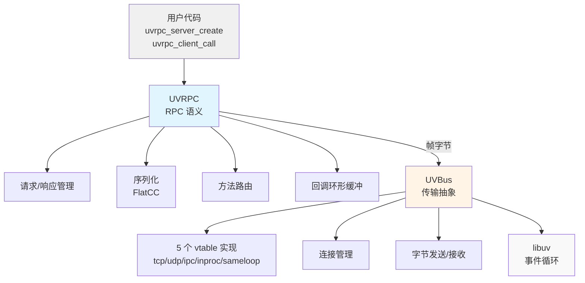

# UVRPC 如何封装 UVBus

本文说明 RPC 层与传输层的接缝。结论：**用户只见 UVRPC API，UVBus 藏在
`uvrpc_server_t` / `uvrpc_client_t` 内部**；接缝只有 `uvbus_send` / `uvbus_send_to`
与一个 4 参数的接收回调。

## 分层



## 服务器侧的真实接线

### 结构体

`src/uvrpc_server.c:28-52`（字段名为真实名）：

```c
typedef struct handler_entry {
    char* name;
    uvrpc_handler_t handler;
    void* ctx;
    UT_hash_handle hh;          /* uthash：method name → handler */
} handler_entry_t;

struct uvrpc_server {
    uv_loop_t* loop;
    char* address;
    uvbus_t* uvbus;             /* 唯一传输句柄 */
    handler_entry_t* handlers;  /* uthash 表头，初值 NULL */
    int is_running;
    int current_clients;
    int max_clients;
    void** client_ctxs;         /* 已见连接的去重数组 */
    int client_ctxs_capacity;
    uvrpc_context_t* ctx;
    uint64_t total_requests, total_responses;
};
```

handler 表是 uthash（`HASH_FIND_STR` / `HASH_ADD_STR`，`src/uvrpc_server.c:170,376,400`），
方法名先小写化再比较。服务器结构里没有 `next_msgid`；请求 ID 由
`uvrpc_msgid_next(client->msgid_ctx)` 在客户端生成。

### 创建：全部经 `uvbus_config_*`

`src/uvrpc_server.c:272-302`：

```c
uvbus_config_t* bus_config = uvbus_config_new();
uvbus_config_set_loop(bus_config, config->loop);
/* 传输类型就是 uvbus_transport_type_t，无需映射 */
uvbus_config_set_transport(bus_config, config->transport);
uvbus_config_set_address(bus_config, server->address);
uvbus_config_set_recv_callback(bus_config, server_recv_callback, server);
server->uvbus = uvbus_server_new(bus_config);
uvbus_config_free(bus_config);      /* 值已拷走；address 被 uvrpc_strdup 复制 */
```

**不存在** `uvbus_server_set_recv_callback()` / `uvbus_server_listen()` /
`uvbus_server_free()` 这类实例级函数。回调只能在 `uvbus_server_new()` **之前**通过
config 设定；总线侧的真实名字是 `uvbus_listen` / `uvbus_stop` / `uvbus_free`
（`include/uvbus.h:279-384`）。`src/uvrpc_server.c:283` 的注释直接写着 "no mapping needed"
—— UVRPC 的 config 用的就是 `uvbus_transport_type_t`（`include/uvrpc.h:215-223`），**没有**
`uvrpc_transport_type_t` 这层枚举，也没有 `convert_transport_type()`。

### 启动与错误映射

`uvrpc_server_start()` 调 `uvbus_listen()`，并把 UVBus 错误码**就地**映射成 RPC 错误码
（`src/uvrpc_server.c:311-322`）：

```c
uvbus_error_t err = uvbus_listen(server->uvbus);
if (err != UVBUS_OK) {
    switch (err) {
        case UVBUS_ERROR_ALREADY_EXISTS: return UVRPC_ERROR_ALREADY_EXISTS;
        case UVBUS_ERROR_NO_MEMORY:      return UVRPC_ERROR_NO_MEMORY;
        case UVBUS_ERROR_INVALID_PARAM:  return UVRPC_ERROR_INVALID_PARAM;
        default:                         return UVRPC_ERROR_TRANSPORT;
    }
}
```

没有一个统一的 `convert_uvbus_error()`：服务器启动与客户端发送各自映射自己关心的分支。
客户端侧只区分 `UVBUS_ERROR_BUFFER_FULL → UVRPC_ERROR_TRANSPORT_BUSY`，其余归入
`UVRPC_ERROR_TRANSPORT`（`src/uvrpc_client.c:517-520`）。

`uvrpc_server_stop()` 只把 `is_running` 置 0（`:333-337`）—— 它**不**关闭传输；真正断开
发生在 `uvrpc_server_free()` → `uvbus_free()`。

### 接收回调

```c
/* src/uvrpc_server.c:59 —— 真实签名是 4 参数 */
static void server_recv_callback(const uint8_t* data, size_t size,
                                 void* client_ctx, void* server_ctx);
```

`client_ctx` 标识这条消息来自哪个连接，`server_ctx` 是创建时传入的 `server`。回调做三件事：

1. **连接去重 + 上限拒绝**：线性扫 `client_ctxs[]` 判断是否新连接；若是新连接且
   `current_clients >= max_clients`，就现场用 flatcc 编一帧 `type=1` 的 Response 回去，
   `data` 里是手写的 `[error_code:u32][len:u32][message]`，然后 `return`
   （`src/uvrpc_server.c:70-121`）。**这正是"错误没有专用帧类型"的具体形态**：错误信息
   挤在 `data` 这个不透明 `[ubyte]` 里，靠错误码约定表达。
2. 解码 `RpcFrame`，按 `method` 查 uthash 找 handler。
3. 构造 `uvrpc_request_t` 后调用 handler。handler 类型是
   `typedef void (*uvrpc_handler_t)(uvrpc_request_t* req, void* ctx)`
   （`include/uvrpc.h:182`）—— 拿到的是**请求对象**，不是 `(msgid, params, size)` 三元组。

回包一律 `uvbus_send_to(server->uvbus, resp, resp_size, client_ctx)`
（`src/uvrpc_server.c:116,221,443,478,511`）。`uvrpc_request_t` 的真实字段
（`include/uvrpc.h:231-239`）：`server`、`msgid`、`method`、`params`、`params_size`、
`client_ctx`、`user_data`。

## 客户端侧的真实接线

`src/uvrpc_client.c:36-70` 的真实字段（节选）：

```c
struct uvrpc_client {
    uv_loop_t* loop;
    char* address;
    uvbus_t* uvbus;
    int is_connected;
    uvrpc_msgid_ctx_t* msgid_ctx;        /* msgid 生成器，不是裸的 next_msgid */
    uvrpc_context_t* ctx;
    uvrpc_connect_callback_t user_connect_callback;  void* user_connect_ctx;
    pending_callback_t** pending_callbacks;           /* 回调路由表 */
    int max_pending_callbacks;                        /* 必须是 2 的幂 */
    int max_concurrent;      /* 在途请求配额 */
    int current_concurrent;  /* 已登记的 pending 回调数，oneway 不计 */
    int max_retries;
    uvasync_scheduler_t* scheduler;
};
```

创建流程与服务器对称（`src/uvrpc_client.c:206-240`），只是走 `uvbus_client_new()`
并多挂一个 `uvbus_config_set_connect_callback()`。

### 连接是异步的

```c
/* src/uvrpc_client.c:296-310 */
int uvrpc_client_connect(uvrpc_client_t* client) {
    if (client->is_connected) return UVRPC_OK;
    uvbus_error_t err = uvbus_connect(client->uvbus);
    if (err != UVBUS_OK) return UVRPC_ERROR_TRANSPORT;
    /* 注意：is_connected 由异步回调置位 */
    return UVRPC_OK;
}
```

返回 `UVRPC_OK` **不等于**已连接。而 `uvrpc_client_call()` 在未连接时直接返回
`UVRPC_ERROR_NOT_CONNECTED`（`:505`）。UVRPC **没有** `uvrpc_is_connected()` ——
`uvbus_is_connected()` 存在，但 `uvbus_t` 对 RPC 用户不可见。所以正确写法是用
`uvrpc_client_connect_with_callback()`（`include/uvrpc.h:525`），在连接回调里发起调用。

`connect_with_callback` 会就地改写 `uvbus->config.connect_cb` 与传输对象的回调槽
（`src/uvrpc_client.c:311-323`）—— 这是**唯一**在 `uvbus_*_new()` 之后改动回调的路径，
属于受控例外，不要把它当成"存在 setter API"的证据。

### 响应的路由

`src/uvrpc_client.c:105` 的 `client_recv_callback` 同样是 4 参数签名。它解码响应后
**不遍历查找**，而是按 msgid 直接命中槽位：

```c
uint32_t idx = msgid & (client->max_pending_callbacks - 1);   /* :146 */
pending_callback_t* pending = client->pending_callbacks[idx];
if (pending && pending->msgid == msgid) { /* 构造 uvrpc_response_t 并回调 */ }
```

用户回调类型是 `typedef void (*uvrpc_callback_t)(uvrpc_response_t* resp, void* ctx)`
（`include/uvrpc.h:190`）—— 状态、错误码、错误文本、结果字节都在 `resp` 上
（`resp->status` / `error_code` / `error_message` / `result` / `result_size` /
`frame_type`，`include/uvrpc.h:247-256`），不是 `(error, result, size, ctx)` 四参数。

`frame_type == 2`（ResponseMore）时槽位**保留**，只有最后一帧 `frame_type == 1` 才清理
（`src/uvrpc_client.c:194-199`）。

## 用户代码示例（真实 API）

### 服务器

```c
#include "uvrpc.h"

static void add_handler(uvrpc_request_t* req, void* ctx) {
    if (req->params_size < 2 * sizeof(int32_t)) {
        uvrpc_response_send_error(req, UVRPC_ERROR_INVALID_PARAM, "expected two int32");
        return;
    }
    const int32_t* a = (const int32_t*)req->params;
    int32_t result = a[0] + a[1];
    uvrpc_response_send(req, (const uint8_t*)&result, sizeof(result));
}

int main(void) {
    uv_loop_t loop;
    uv_loop_init(&loop);

    uvrpc_config_t* config = uvrpc_config_new();
    uvrpc_config_set_loop(config, &loop);
    uvrpc_config_set_address(config, "tcp://127.0.0.1:5555");
    uvrpc_config_set_transport(config, UVBUS_TRANSPORT_TCP);

    uvrpc_server_t* server = uvrpc_server_create(config);
    uvrpc_server_register(server, "Calculator.Add", add_handler, NULL);
    uvrpc_server_start(server);

    uv_run(&loop, UV_RUN_DEFAULT);

    uvrpc_server_free(server);      /* 内部先 stop 再 uvbus_free() */
    uvrpc_config_free(config);
    uv_loop_close(&loop);
    return 0;
}
```

应答的三个真实函数：`uvrpc_response_send()`（`include/uvrpc.h:465`）、
`uvrpc_response_send_error()`（`:475`）、`uvrpc_response_send_stream()`（`:490`）。

### 客户端

```c
#include "uvrpc.h"

static void on_response(uvrpc_response_t* resp, void* ctx) {
    if (resp->status == UVRPC_OK && resp->result_size >= sizeof(int32_t)) {
        printf("Result: %d\n", *(const int32_t*)resp->result);
    } else {
        printf("Error %d: %s\n", resp->error_code,
               resp->error_message ? resp->error_message : "(none)");
    }
}

static void on_connected(int status, void* ctx) {
    uvrpc_client_t* client = (uvrpc_client_t*)ctx;
    if (status != 0) { fprintf(stderr, "connect failed: %d\n", status); return; }
    int32_t args[2] = {10, 20};
    uvrpc_client_call(client, "Calculator.Add",
                      (const uint8_t*)args, sizeof(args), on_response, NULL);
}

int main(void) {
    uv_loop_t loop;
    uv_loop_init(&loop);

    uvrpc_config_t* config = uvrpc_config_new();
    uvrpc_config_set_loop(config, &loop);
    uvrpc_config_set_address(config, "tcp://127.0.0.1:5555");
    uvrpc_config_set_transport(config, UVBUS_TRANSPORT_TCP);

    uvrpc_client_t* client = uvrpc_client_create(config);
    uvrpc_client_connect_with_callback(client, on_connected, client);

    uv_run(&loop, UV_RUN_DEFAULT);

    uvrpc_client_free(client);
    uvrpc_config_free(config);
    uv_loop_close(&loop);
    return 0;
}
```

> 完整、可编译的对照请以 `examples/` 与 `docs/quick-start.md` 为准。

## 封装带来的性质

1. **用户无需知道 UVBus 存在**：RPC API 的签名里没有 `uvbus_t`。需要下沉一层时可以直接
   用 `include/uvbus.h`，它是公开头。
2. **加传输不动 RPC 层**：5 个驱动实现同一份 7 槽 vtable（`include/uvbus.h:129-137`），
   RPC 层只调 `uvbus_send*()`。
3. **线程/锁由分层共同保证**：RPC 层与传输层都没有锁与线程；INPROC/SAMELOOP 的共享状态
   在调用方创建并传入的注册表里（`src/uvbus_loop_registry.h`），既不是进程全局，
   也不占用 loop 的字段。
4. **向后兼容**：RPC 层 API 稳定，UVBus 内部优化对用户透明。
5. **分层可测**：UVBus 有独立的传输层测试（`tests/uvbus_test.c`、
   `tests/uvbus_simple_test.c`、`tests/unit/test_uvbus.cpp`），RPC 测试则跑在**真实**
   传输上 —— 没有 mock 传输实现。

## 注意事项

- **`params` / `result` 指针的生命周期**：handler 里的 `req->params` 指向帧数据，回调返回
  后失效；callback 里的 `resp->result` 由框架在回调结束后释放（`include/uvrpc.h:258-272`
  的 IMPORTANT 块）。要跨回调保留必须自己拷贝。
- **flatcc 缓冲区由 flatcc 自己的分配器产生**：`uvrpc_encode_*()` 返回的字节来自
  `flatcc_builder_finalize_buffer()`，而 flatcc 没有接入 uvrpc 的分配器钩子。这类缓冲区
  只能用 `free()` 释放 —— 自定义分配器（`UVRPC_ALLOCATOR_DEFAULT=custom`）下
  `uvrpc_free()` 是一个不认识 malloc 指针的池。库内部用
  `uvrpc_free_encoded()`（`src/uvrpc_flatbuffers.h`）表达这条规则；调用
  `uvrpc_encode_*()` 的用户代码直接 `free()` 即可。
- **`max_clients` 传 0 不是"无限"**：`src/uvrpc_server.c:259` 把 0 变成默认 1024，
  不存在 unlimited 模式（头文件注释此前写作 "0 = unlimited"，2026-09-29 已改正）。
- **INPROC 的连接判定是 O(已见连接数)**：`client_ctxs` 靠线性扫去重
  （`src/uvrpc_server.c:70-76`），大量短连接场景下这笔开销会落在接收热路径上。
