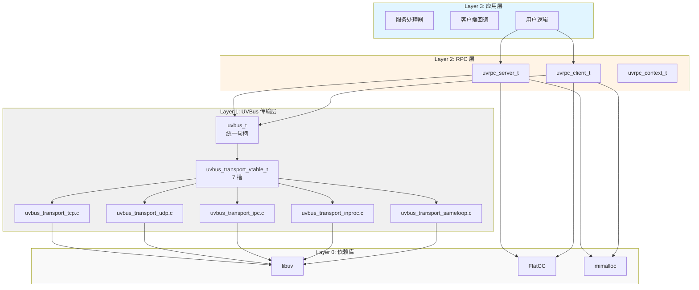

# UVRPC Design Philosophy

## 核心原则

### 1. 极简设计 (Minimalist Design)

UVRPC 追求极致的简洁性，每个设计决策都遵循"少即是多"的原则：

#### 单一职责原则
- **最小化 API**：仅提供必要的函数，每个函数只做一件事
- **零冗余**：不提供重复或替代的功能
- **清晰接口**：每个函数的参数和返回值都清晰明确

#### 统一的编程模型
- **一致的命名**：`uvrpc_module_action` 格式，直观易懂
- **统一的错误处理**：所有函数返回相同风格的错误码
- **统一的回调模式**：所有异步操作使用一致的回调签名

#### 直观的使用流程
**服务端（代码生成模式）**：
```c
// 1. 创建配置
uvrpc_config_t* config = uvrpc_config_new();
uvrpc_config_set_loop(config, &loop);
uvrpc_config_set_address(config, "tcp://127.0.0.1:5555");
uvrpc_config_set_transport(config, UVBUS_TRANSPORT_TCP);

// 2. 创建服务器（自动生成服务端代码，包含处理器注册）
Calculator_server_t* server = Calculator_server_create(config);

// 3. 启动并运行
Calculator_server_start(server);
uv_run(&loop, UV_RUN_DEFAULT);
```

**服务端（通用模式，利于 loop 复用）**：
```c
// 1. 创建配置
uvrpc_config_t* config = uvrpc_config_new();
uvrpc_config_set_loop(config, &loop);
uvrpc_config_set_address(config, "tcp://127.0.0.1:5555");
uvrpc_config_set_transport(config, UVBUS_TRANSPORT_TCP);

// 2. 创建服务器（通用 API，支持多服务复用 loop）
uvrpc_server_t* server = uvrpc_server_create(config);

// 3. 注册处理器
uvrpc_server_register(server, "Calculator.Add", calculator_add_handler, NULL);
uvrpc_server_register(server, "Calculator.Subtract", calculator_subtract_handler, NULL);

// 4. 启动并运行
uvrpc_server_start(server);
uv_run(&loop, UV_RUN_DEFAULT);
```

**处理器自动生成**：
```flatbuffers
// 在 FlatBuffers schema 中声明服务
namespace Example;

table AddRequest {
  a: int;
  b: int;
}

table AddResponse {
  result: int;
}

rpc_service Calculator {
  Add(AddRequest): AddResponse;
}
```

```c
// 自动生成的代码（无需手写）
Calculator_Add(client, request, response_callback, ctx);
```

**客户端（代码生成模式）**：
```c
// 1. 创建配置
uvrpc_config_t* config = uvrpc_config_new();
uvrpc_config_set_loop(config, &loop);
uvrpc_config_set_address(config, "tcp://127.0.0.1:5555");
uvrpc_config_set_transport(config, UVBUS_TRANSPORT_TCP);

// 2. 创建客户端（自动生成客户端代码）
Calculator_client_t* client = Calculator_client_create(config);

// 3. 调用 RPC（自动生成的类型安全函数）
Calculator_Add(client, request, response_callback, ctx);

// 4. 运行事件循环
uv_run(&loop, UV_RUN_DEFAULT);
```

**客户端（通用模式，利于 loop 复用）**：
```c
// 1. 创建配置
uvrpc_config_t* config = uvrpc_config_new();
uvrpc_config_set_loop(config, &loop);
uvrpc_config_set_address(config, "tcp://127.0.0.1:5555");
uvrpc_config_set_transport(config, UVBUS_TRANSPORT_TCP);

// 2. 创建客户端（通用 API，支持多服务复用 loop）
uvrpc_client_t* client = uvrpc_client_create(config);

// 3. 连接并调用
uvrpc_client_connect(client);
uvrpc_client_call(client, "Calculator.Add", params, size, callback, NULL);

// 4. 运行事件循环
uv_run(&loop, UV_RUN_DEFAULT);
```

#### 低学习成本
- **单头文件**：只需包含 `uvrpc.h` 即可使用所有功能
- **代码生成**：使用 FlatBuffers DSL 声明服务，自动生成类型安全的 API
- **自动生成处理器**：服务端处理器和客户端调用代码自动生成，无需手写
- **类型安全**：生成的代码提供编译时类型检查，避免运行时错误

### 2. 零线程，零锁，零可变全局

UVRPC 基于 libuv 事件循环，所有 I/O 操作都在单线程中异步执行：

- **零线程**：不创建额外线程，所有操作在事件循环中完成
- **零锁**：单线程模型，无需锁机制
- **零文件作用域可变全局**：所有状态通过上下文传递，支持多实例

#### 可变全局策略

准确的说法是"零**可变**全局"，不是"零全局"。区分点是：编译期常量、函数指针表、
只读元数据可以存在；会被请求改写的文件作用域变量不行。

**用户层面**：
- **多实例支持**：同一进程可以创建多个独立的 UVRPC 实例
- **灵活的事件循环**：多个实例可以在多个 loop 中独立运行，也可以共享同一个 loop
- **单线程无竞争**：每个实例在自己的事件循环中运行；框架不创建线程，因此不共享可变状态
- **一处需要你动手**：INPROC/SAMELOOP 需要你创建一个端点注册表并传给要互相通信的
  每个 config（见下）。TCP/UDP/IPC 不需要

**实现层面**：
- **INPROC/SAMELOOP 传输**：端点表放在**调用方创建并传入的注册表**里，既不是进程全局，
  也不占用 loop 的字段
- **内存分配器**：只有自定义分配器模式下有一个全局函数指针表 `g_custom_allocator`，
  且被编译门控（`UVRPC_DEFAULT_ALLOCATOR == UVRPC_ALLOCATOR_CUSTOM`）；
  system/mimalloc 构建里**没有任何分配器状态**
- **vtable 是常量**：5 个传输的 `static const uvbus_transport_vtable_t` 落在
  `.data.rel.ro.local`，运行时只读
- **设计原则**：优先"把状态挂到本来就该拥有它的对象上"（`loop`、`client`、`server`），
  全局只在无处安放时才考虑

**INPROC/SAMELOOP 的实际做法**：

server 与 client 由两份独立 config 创建，它们需要共享的只有端点表。于是由**调用方**创建
这张表，并把它传给需要互相看得见的每一个 config——从而实现**零可变全局 + 零锁**，
同时框架不在用户的 loop 上留任何东西：

```c
/* src/uvbus_loop_registry.h —— 真实实现 */
typedef struct uvbus_loop_registry {
    uint32_t magic;          /* 用来识别这个指针是不是我们的 */
    int      refcount;       /* retain on listen/connect, release on free */
    void*    inproc_endpoints;   /* 256 桶哈希表 */
    void*    sameloop_servers;   /* 单链表 */
} uvbus_loop_registry_t;

uvbus_loop_registry_t* reg = uvbus_loop_registry_new();
uvrpc_config_set_loop_registry(server_config, reg);
uvrpc_config_set_loop_registry(client_config, reg);
```

**为什么是这个 API**：曾经把注册表挂在 `loop->data` 上——libuv 唯一的 per-loop 用户字段。
但判断"这个指针是不是我们的"必须**解引用**它，而 libuv 1.47 的 `uv_loop_init()` 刻意保留
该字段，于是 `uv_loop_t loop; uv_loop_init(&loop);`（libuv 官方文档的写法）会把栈上残留
留在那里，实测约五次里崩一次。改由调用方传入之后，调用方对自己的 loop 做什么都碰不到它。
详见 [架构文档](/architecture/)。

两个注册表互不可见——这正是原来"按 loop 分区"的语义，现在由调用方显式表达：

```c
/* 两组互不相关的端点：各用各的注册表 */
uvbus_loop_registry_t* reg_a = uvbus_loop_registry_new();
uvbus_loop_registry_t* reg_b = uvbus_loop_registry_new();

uvrpc_config_set_loop_registry(config_a, reg_a);
uvrpc_config_set_loop_registry(config_b, reg_b);
```

这也意味着一个语义后果：**`inproc://name` 的作用域是单个 loop，不是整个进程**。
跨 loop 用同名端点是找不到的。

### 3. 性能驱动

- **零拷贝**：FlatBuffers 序列化，数据直接访问；INPROC/SAMELOOP 传指针
- **高效分配**：默认使用 mimalloc 分配器
- **批量提交**：`uvrpc_client_call_batch()` 一次调用发 N 帧（注意：自动攒批 +
  定时 flush 的那条路径目前只是字段，见[单线程模型](/guide/single-thread-model)）
- **事件驱动**：非阻塞 I/O，满则拒绝而非等待

### 4. 透明度优先

- **公开结构体**：所有结构体定义公开，用户可直接访问
- **无隐藏魔法**：没有内部状态或隐藏逻辑
- **完全控制**：用户可完全控制对象生命周期

### 5. 循环注入与 Loop 复用

支持自定义 libuv event loop，提供灵活的多实例部署：

#### 循环注入模式
```c
uv_loop_t custom_loop;
uv_loop_init(&custom_loop);

uvrpc_config_t* config = uvrpc_config_new();
uvrpc_config_set_loop(config, &custom_loop);

uvrpc_server_t* server = uvrpc_server_create(config);
uvrpc_server_start(server);

uv_run(&custom_loop, UV_RUN_DEFAULT);
```

#### Loop 复用策略

**代码生成模式的改进**：
- 每个服务生成独立的函数前缀（如 `uvrpc_MathService_create_server`）
- 不同服务可以共享同一个 loop，无函数签名冲突
- 支持动态注册多个服务到同一个 loop
- 适合多服务场景和 loop 复用

**通用 API 模式的优势**：
- 使用通用的 `uvrpc_server_t` 和 `uvrpc_client_t` 类型
- 多个服务可以共享同一个 loop
- 支持动态注册和注销处理器
- 适合需要精细控制的多服务场景

**Loop 复用示例（代码生成模式）**：
```c
/* 多服务共享同一个 loop */
uv_loop_t loop;
uv_loop_init(&loop);

/* 服务 1：Calculator */
uvrpc_server_t* math_server = uvrpc_mathservice_create_server(&loop, "tcp://127.0.0.1:5555");
uvrpc_mathservice_start_server(math_server);

/* 服务 2：Echo */
uvrpc_server_t* echo_server = uvrpc_echoservice_create_server(&loop, "tcp://127.0.0.1:5556");
uvrpc_echoservice_start_server(echo_server);

/* 服务 3：User */
uvrpc_server_t* user_server = uvrpc_userservice_create_server(&loop, "tcp://127.0.0.1:5557");
uvrpc_userservice_start_server(user_server);

/* 所有服务在同一个 loop 中运行 */
uv_run(&loop, UV_RUN_DEFAULT);

/* 清理 */
uvrpc_mathservice_free_server(math_server);
uvrpc_echoservice_free_server(echo_server);
uvrpc_userservice_free_server(user_server);
```

**Loop 复用示例（通用 API 模式）**：
```c
/* 多服务共享同一个 loop */
uv_loop_t loop;
uv_loop_init(&loop);

/* 服务 1：Calculator */
uvrpc_config_t* config1 = uvrpc_config_new();
uvrpc_config_set_loop(config1, &loop);
uvrpc_config_set_address(config1, "tcp://127.0.0.1:5555");
uvrpc_server_t* server1 = uvrpc_server_create(config1);
uvrpc_server_register(server1, "Calculator.Add", calc_add_handler, NULL);
uvrpc_server_register(server1, "Calculator.Subtract", calc_subtract_handler, NULL);
uvrpc_server_start(server1);

/* 服务 2：Echo */
uvrpc_config_t* config2 = uvrpc_config_new();
uvrpc_config_set_loop(config2, &loop);
uvrpc_config_set_address(config2, "tcp://127.0.0.1:5556");
uvrpc_server_t* server2 = uvrpc_server_create(config2);
uvrpc_server_register(server2, "Echo.EchoString", echo_handler, NULL);
uvrpc_server_start(server2);

/* 所有服务在同一个 loop 中运行 */
uv_run(&loop, UV_RUN_DEFAULT);
```

**优势**：
- **多实例支持**：同一进程可创建多个独立 UVRPC 实例
- **灵活部署**：可选择独立运行或共享事件循环
- **单元测试友好**：每个测试可使用独立的事件循环
- **云原生兼容**：适合容器化部署和微服务架构
- **资源优化**：多服务共享 loop，减少线程创建开销

### 6. 异步统一

所有操作都是异步的：

- 服务端：通过回调处理请求
- 客户端：通过回调接收响应
- 连接：异步建立，通过回调通知

### 7. 多协议支持与统一抽象

支持多种传输协议，使用统一的抽象接口，使用方式完全相同：

```c
/* TCP 传输 */
uvrpc_config_t* config = uvrpc_config_new();
uvrpc_config_set_address(config, "tcp://127.0.0.1:5555");
uvrpc_config_set_transport(config, UVBUS_TRANSPORT_TCP);

/* UDP 传输 */
uvrpc_config_t* config = uvrpc_config_new();
uvrpc_config_set_address(config, "udp://127.0.0.1:5555");
uvrpc_config_set_transport(config, UVBUS_TRANSPORT_UDP);

/* IPC 传输 */
uvrpc_config_t* config = uvrpc_config_new();
uvrpc_config_set_address(config, "ipc:///tmp/uvrpc.sock");
uvrpc_config_set_transport(config, UVBUS_TRANSPORT_IPC);

/* INPROC 传输 */
uvrpc_config_t* config = uvrpc_config_new();
uvrpc_config_set_address(config, "inproc://my_service");
uvrpc_config_set_transport(config, UVBUS_TRANSPORT_INPROC);
```

**统一的调用方式**：
- 所有传输协议使用相同的 API 调用
- 服务端：`uvrpc_server_create()`, `uvrpc_server_start()`
- 客户端：`uvrpc_client_create()`, `uvrpc_client_connect()`, `Calculator_Add()`（自动生成）
- 回调模式：连接回调、接收回调、响应回调
- **仅需修改 URL**：更换传输协议只需修改地址前缀

**代码生成带来的便利**：
- **无需手写处理器注册**：自动生成服务端处理器代码
- **无需手写客户端调用**：自动生成类型安全的客户端调用函数
- **编译时类型检查**：参数类型、返回类型自动验证
- **减少样板代码**：自动生成序列化/反序列化代码

## 极简设计的体现

### 两种使用模式

UVRPC 提供两种使用模式，满足不同场景需求：

**模式一：代码生成模式（快速开发）**
- 服务端：`<Service>_server_create()` 自动生成完整的服务端代码
- 客户端：`<Service>_client_create()` 自动生成完整的客户端代码
- 优势：快速开发，类型安全，减少样板代码
- 场景：单服务项目，快速原型开发

**模式二：通用 API 模式（灵活复用）**
- 服务端：`uvrpc_server_create()` + `uvrpc_server_register()` 手动注册处理器
- 客户端：`uvrpc_client_create()` + `uvrpc_client_call()` 手动指定方法名
- 优势：loop 复用，多服务共享，灵活控制
- 场景：多服务项目，loop 复用，精细控制

### API 最小化

**通用 API（约 10 个函数）**：
- `uvrpc_config_new()`, `uvrpc_config_free()`
- `uvrpc_config_set_loop()`, `uvrpc_config_set_address()`
- `uvrpc_config_set_transport()`
- `uvrpc_server_create()`, `uvrpc_server_start()`, `uvrpc_server_free()`
- `uvrpc_server_register()`
- `uvrpc_client_create()`, `uvrpc_client_connect()`, `uvrpc_client_free()`
- `uvrpc_client_call()`

**代码生成 API（自动生成）**：
- 每个服务自动生成：`<Service>_server_create()`, `<Service>_server_start()`, `<Service>_client_create()`
- 自动生成类型安全的调用函数：`<Service>_<Method>()`
- 无需手动注册处理器和指定方法名

### 数据结构最小化

所有数据结构都只包含必要的字段：

```c
// 配置结构体（include/uvrpc.h:215-223，真实字段）
struct uvrpc_config {
    uv_loop_t* loop;
    char* address;
    uvbus_transport_type_t transport;   // 就是 UVBus 的枚举，没有第二层类型
    int max_concurrent;
    int max_pending_callbacks;
    uint32_t msgid_offset;
    int max_clients;
};

// 请求结构体（include/uvrpc.h:231-239，真实字段）
struct uvrpc_request {
    uvrpc_server_t* server;
    uint32_t msgid;
    char* method;             // 仅回调期间有效
    uint8_t* params;          // 仅回调期间有效
    size_t params_size;
    void* client_ctx;         // 回包时用：uvbus_send_to(..., client_ctx)
    void* user_data;
};
```

`transport` 字段直接用 `uvbus_transport_type_t` —— RPC 层与传输层**共用同一个枚举**，
没有 `uvrpc_transport_type` / `uvrpc_comm_type_t` 这层中间类型，也没有映射函数。
"是 server 还是 client"由创建哪个对象决定（`uvrpc_server_create` vs
`uvrpc_client_create`），不占字段。

### 依赖最小化

UVRPC 的运行期依赖只有 3 个库：

1. **libuv**：事件循环（必需）
2. **FlatCC**：FlatBuffers 编解码（必需，且需要源码构建 —— 发行版没有现成包）
3. **mimalloc**：默认分配器（可切 `-DUVRPC_ALLOCATOR_DEFAULT=system|custom`）

**uthash** 是编译期头文件依赖，用在两处：服务端 `method name → handler` 表
（`src/uvrpc_server.c`）与网关 ID 映射（`src/uvrpc_idmap.c`）。它不是"项目回避哈希表"
的反例 —— 客户端在途回调路由刻意改成了数组直接寻址，理由见
[单线程模型](/guide/single-thread-model)。

**GoogleTest** 只在 `-DUVRPC_BUILD_TESTS=ON` 时才需要，库使用者不需要。

### 编译最小化

```bash
# 依赖必须先构建（libuv/flatcc/mimalloc/uthash/gtest 走子模块）
git clone https://github.com/adam-ikari/uvrpc.git && cd uvrpc
./scripts/setup_deps.sh
./build.sh release

# 或直接用 CMake
cmake -S . -B build -DCMAKE_BUILD_TYPE=Release
cmake --build build
```

`./build.sh` 接受 `[clean|debug|release|system|mimalloc]`；产物固定落在
`dist/lib/libuvrpc.a` 与 `dist/bin/`。跳过 `setup_deps.sh` 会在
`cmake/Dependencies.cmake` 处直接失败并提示原因。

### 配置最小化

无需复杂的配置文件，所有配置通过代码完成：

```c
// 无需配置文件，无需环境变量
uvrpc_config_t* config = uvrpc_config_new();
uvrpc_config_set_address(config, "tcp://127.0.0.1:5555");
```

## 架构设计

### 分层架构



### 统一的传输抽象

**传输接口（`include/uvbus.h:129-137`，真实定义）**：

```c
typedef struct uvbus_transport_vtable {
    int  (*listen)(void* impl, const char* address);
    int  (*connect)(void* impl, const char* address);
    void (*disconnect)(void* impl);
    int  (*send)(void* impl, const uint8_t* data, size_t size);
    int  (*send_to)(void* impl, const uint8_t* data, size_t size, void* target);
    int  (*broadcast)(void* impl, const uint8_t* data, size_t size);
    void (*free)(void* impl);
} uvbus_transport_vtable_t;
```

三个要点：

- **7 个槽，回调不在槽里**。回调挂在 `uvbus_config` 上，创建实例时一次性拷进传输对象；
  vtable 只描述"对这个传输能做什么"，不描述"谁接收结果"。
- **每个槽的第一个参数都是 `void* impl`**。传输专有状态（`uv_tcp_t` / `uv_pipe_t` /
  socket / sameloop server 条目）藏在 impl 结构里，总线层只见指针。新增一个传输因此
  不需要动总线、RPC 层或任何调用点。
- **没有 `set_timeout` 这种可选槽**。传输层不需要超时能力位，总线配置里也没有超时
  字段（曾经有 `timeout_ms` / `enable_timeout`，无人读取，已删除）。超时属于调用方
  语义：`uvrpc_async_*` 用显式入参自己起 `uv_timer`。

vtable 本身是 `static const`，实例创建时单次赋值 —— 实测落在 `.data.rel.ro.local`
（PIE 下的只读数据），这属于"零可变全局"允许的范畴。

**统一的使用方式**：
```c
/* 无论使用哪种传输协议，API 调用完全相同 */

/* 1. 创建配置 */
uvrpc_config_t* config = uvrpc_config_new();
uvrpc_config_set_loop(config, &loop);

/* 2. 设置传输类型和地址（仅此处不同） */
uvrpc_config_set_transport(config, UVBUS_TRANSPORT_TCP);    // 或 UDP/IPC/INPROC
uvrpc_config_set_address(config, "tcp://127.0.0.1:5555");   // 或 udp:// /ipc:// /inproc://

/* 3. 创建服务器/客户端（完全相同） */
uvrpc_server_t* server = uvrpc_server_create(config);
uvrpc_client_t* client = uvrpc_client_create(config);

/* 4. 注册处理器/连接（完全相同） */
uvrpc_server_register(server, "method", handler, NULL);
uvrpc_client_connect(client);

/* 5. 调用 RPC（完全相同） */
uvrpc_client_call(client, "method", params, size, callback, NULL);
```

**传输协议切换**：
```c
/* 只需修改这两行，其他代码无需改变 */

/* 从 TCP 切换到 UDP */
uvrpc_config_set_transport(config, UVBUS_TRANSPORT_UDP);
uvrpc_config_set_address(config, "udp://127.0.0.1:5555");

/* 从 UDP 切换到 INPROC */
uvrpc_config_set_transport(config, UVBUS_TRANSPORT_INPROC);
uvrpc_config_set_address(config, "inproc://my_service");
```

### 数据流

#### 请求-响应流程

```
客户端                              服务端
  │                                   │
  │  1. uvrpc_client_call()           │
  │     ↓                              │
  │  2. encode_request()              │
  │     ↓                              │
  │  3. transport_send()              │
  │──────────────────────────────────>│
  │                                   │ 4. transport_recv()
  │                                   │    ↓
  │                                   │ 5. decode_request()
  │                                   │    ↓
  │                                   │ 6. handler()
  │                                   │    ↓
  │                                   │ 7. encode_response()
  │                                   │    ↓
  │<──────────────────────────────────│ 8. transport_send()
  │  9. transport_recv()              │
  │     ↓                              │
  │ 10. decode_response()             │
  │     ↓                              │
  │ 11. callback()                     │
  │                                   │
```

### INPROC 与 SAMELOOP 传输架构

#### 设计目标

进程内通信有两个传输，差别在"要不要出栈"：

- **INPROC**：同进程、同 loop 家族，按名字找端点，数据指针直接传递（零拷贝）。
- **SAMELOOP**：要求 server 与 client 在**同一个 `uv_loop_t` 实例**上，走 `uv_async`
  交接，延迟最低，且有 vtable 短路。

两者都**不需要网络栈、不需要锁、不需要进程全局**。

#### 架构实现

```mermaid
graph TB
    subgraph L["同一个 uv_loop_t"]
        R[调用方创建的<br/>uvbus_loop_registry_t<br/>magic + refcount]
        subgraph SV["uvrpc_server_t → uvbus_t"]
            S1[uvbus_transport_inproc.c<br/>inproc_vtable: static const]
            E[inproc_endpoint_t<br/>name / server_transport / clients[]]
        end
        subgraph CL["uvrpc_client_t → uvbus_t"]
            C1[client transport<br/>inproc_client_t]
        end
        R --> E
        S1 --> E
        C1 -->|按名字查找| E
    end
    style R fill:#fff4e6
    style E fill:#e1f5ff
```

**注册表不是全局的**，由调用方创建并传给 config（`src/uvbus_loop_registry.h`）：
magic `0x55524300`（`'URC\0'`）+ refcount + 两个容器头。因此
`inproc://name` 的作用域是**单个注册表**，不是整个进程；两个注册表上的同名端点互不可见。

#### 端点管理

**端点结构**（`src/uvbus_transport_inproc.c:13-24`，真实字段）：

```c
typedef struct inproc_endpoint {
    char* name;
    void* server_transport;
    void** clients;
    int client_count;
    int client_capacity;
    struct inproc_endpoint* next;      /* 同一桶内的链表 */
    uvbus_recv_callback_t recv_cb;
    uvbus_error_callback_t error_cb;
    void* callback_ctx;
} inproc_endpoint_t;
```

**端点查找**：per-loop 注册表里是一个 **256 桶哈希表**（`UVBUS_INPROC_HASH_SIZE =
UVBUS_HASH_TABLE_SIZE = 256`，djb2 哈希），桶内单链表。所有操作都显式接收
`uvbus_loop_registry_t*`：

```c
static inproc_endpoint_t* inproc_find_endpoint(uvbus_loop_registry_t* reg, const char* name);
static void                inproc_add_endpoint(uvbus_loop_registry_t* reg, inproc_endpoint_t* endpoint);
static void                inproc_remove_endpoint(uvbus_loop_registry_t* reg, inproc_endpoint_t* endpoint);
```

**没有 `g_endpoint_list`，也没有读写锁。** 早期文档里"INPROC 用全局链表 + 互斥锁保护"
的描述对应的是 `4fe8b67` 之前的实现，现在既不成立也不是设计意图 —— 加锁会直接违反
零锁，进程全局会直接违反零可变全局。SAMELOOP 侧则真的就是一条单链表
（`reg->sameloop_servers`，O(服务数) 查找），因为它面向"同 loop 内少量服务"。

#### 通信流程

**服务器监听**（`src/uvbus_transport_inproc.c:173-230`）：

```c
inproc_listen(impl, "inproc://test_endpoint")
  ├─ reg = uvbus_loop_registry_retain(transport->registry)  // config 传入的注册表
  │    └─ 若未传入注册表 → 返回 NULL → listen 失败（错误信息指名创建方法）
  ├─ inproc_buckets_ensure(reg)                          // 惰性分配 256 桶
  ├─ name = address + strlen("inproc://")
  ├─ inproc_find_endpoint(reg, name)  → 已存在则返回 UVBUS_ERROR_ALREADY_EXISTS
  └─ inproc_add_endpoint(reg, endpoint)
```

**客户端连接**（`:252+`）：`retain(loop)` → `inproc_find_endpoint(reg, name)` →
`inproc_add_client(endpoint, client)`（客户端数组容量翻倍扩容）。找不到端点即失败，
不隐式创建。

**发送**（`:376-407`）是**同步直接调用**，没有拷贝也没有排队：

```c
/* client → server */
endpoint->recv_cb(data, size, client /* 即 client_ctx */, server_ctx);
/* server → client：inproc_send_to_all() 遍历 endpoint->clients[] 逐个回调 */
```

三个含义：
1. `data` 是**发送方的缓冲区**，回调返回后即可能失效 —— 这正是"回调期间有效"约束的根源。
2. 调用栈是 `send() → 对端 recv_cb → 对端可能再 send()`。层数过深会加深栈，
   SAMELOOP 用 `uv_async` 交接正是为了切断这种递归（`src/uvbus_transport_sameloop.c:10`）。
3. `client_ctx` 就是 `inproc_client_t*`，服务端凭它区分是哪个连接 —— 与 TCP 侧
   `uvbus_send_to(..., client_ctx)` 是同一个约定。

#### 内存管理

**端点生命周期**：
- `listen()` 时创建，加入所属 loop 的注册表
- 服务端 `disconnect` / `free` 时摘除
- refcount 归零时释放桶数组；调用方用 `uvbus_loop_registry_free()` 释放自己那份

**客户端列表**：初始容量小、断开时按 `inproc_remove_client` 摘除、翻倍扩容
（`src/uvbus_transport_inproc.c:103-115`）。

**回调复制**：连接时把回调从传输对象复制进 `inproc_client_t`，避免传输层释放后
访问无效指针。

#### 性能特性

**零拷贝**：数据指针直接传递；无序列化额外开销（RPC 帧在上一层已编好）。

**低延迟**：无网络栈、无系统调用、无上下文切换 —— 但要清楚它是**同步回调**，
不是"异步得像网络"。需要异步交接用 SAMELOOP。

**高吞吐的边界**：
- 无锁、无拷贝，但服务端**不**做批量：一次 `send` 就是一次回调遍历。
- `client_ctxs` 在 RPC 层是线性扫去重（`src/uvrpc_server.c:70-76`），大量短连接时
  这笔 O(n) 会落在接收热路径上。
- SAMELOOP 每 server 固定 `SAMELOOP_MAX_CLIENTS = 64`，不扩容。

#### 使用示例

```c
// 服务器
uv_loop_t loop;
uv_loop_init(&loop);

uvrpc_config_t* config = uvrpc_config_new();
uvrpc_config_set_loop(config, &loop);
uvrpc_config_set_address(config, "inproc://my_endpoint");
uvrpc_config_set_transport(config, UVBUS_TRANSPORT_INPROC);

uvrpc_server_t* server = uvrpc_server_create(config);
uvrpc_server_register(server, "add", add_handler, NULL);
uvrpc_server_start(server);

uv_run(&loop, UV_RUN_DEFAULT);

// 客户端（同一进程）
uv_loop_t loop;
uv_loop_init(&loop);

uvrpc_config_t* config = uvrpc_config_new();
uvrpc_config_set_loop(config, &loop);
uvrpc_config_set_address(config, "inproc://my_endpoint");
uvrpc_config_set_transport(config, UVBUS_TRANSPORT_INPROC);

uvrpc_client_t* client = uvrpc_client_create(config);
uvrpc_client_connect(client);

uvrpc_client_call(client, "add", params, size, callback, NULL);

uv_run(&loop, UV_RUN_DEFAULT);
```

## 内存管理

### 分配器支持

UVRPC 支持三种内存分配器：

1. **mimalloc** (默认)：高性能内存分配器
2. **system**：标准 malloc/free
3. **custom**：用户自定义分配器

### 内存分配策略

- **零拷贝**：FlatBuffers 数据直接访问，无需拷贝
- **批量分配**：减少分配次数
- **及时释放**：回调完成后立即释放

## 错误处理

### 错误码

```c
#define UVRPC_OK 0
#define UVRPC_ERROR -1
#define UVRPC_ERROR_INVALID_PARAM -2
#define UVRPC_ERROR_NO_MEMORY -3
#define UVRPC_ERROR_NOT_CONNECTED -4
#define UVRPC_ERROR_TIMEOUT -5
#define UVRPC_ERROR_TRANSPORT -6
```

### 错误处理模式

```c
int ret = uvrpc_client_connect(client);
if (ret != UVRPC_OK) {
    // 处理错误
    fprintf(stderr, "Connection failed: %d\n", ret);
}
```

## 性能优化

### 零拷贝优化

- FlatBuffers 数据直接访问
- 避免不必要的内存拷贝
- 使用指针传递数据

### 事件循环优化

- 单线程事件循环
- 非阻塞 I/O
- 批量提交靠显式的 `uvrpc_client_call_batch()`，没有自动攒批

### 内存分配优化

- 使用 mimalloc 分配器
- 减少内存碎片
- 提高分配速度

### 没有性能模式开关

这里曾有一个 `uvrpc_config_set_performance_mode(config, UVRPC_PERF_LOW_LATENCY |
UVRPC_PERF_HIGH_THROUGHPUT)`。它的值一路被存进 config、复制进客户端、用来推出
`batching_enabled`，然后**再没有任何代码读取** —— 自动攒批、批量 flush、定时冲刷全都
没有接线，`pool_size` / `timeout_ms` / `pump_interval` 同属一类。2026-09-29 把这些
只写字段连同它们的 setter 一起删除了（判据与历史见项目记忆
`pending-buffer-as-concurrency-control`）。

现在客户端可调的就三件事：`max_concurrent`（在途请求配额，单次与批量调用都检查）、
`max_pending_callbacks`（回调路由表容量，必须是 2 的幂）、`max_clients`（服务端连接
配额）。想要"一次发 N 帧"请显式调用 `uvrpc_client_call_batch()` —— 它是真实的，
但仍然逐帧登记回调槽位。

**性能数字**：本节不给按模式区分的 ops/s。真实吞吐取决于传输、消息大小和主机，
请用 `benchmark/perf_benchmark.c` 在自己的机器上测（见 [Benchmark](/guide/benchmark)）。
没有标注主机与配置的吞吐数字不写进文档。

#### 回调路由数组

客户端响应路由使用定长指针数组，`idx = msgid & (max_pending_callbacks - 1)`
（`src/uvrpc_client.c:250`）：

- **O(1) 查找**：位与代替取模，直接数组访问，无哈希计算
- **可配置**：运行时 `uvrpc_config_set_max_pending_callbacks(config, n)`。`n` 必须是
  2 的幂、且落在 `[64, UVRPC_MAX_PENDING_CALLBACKS]`（`1<<22`）内；不满足时**静默回落**
  到 `UVRPC_DEFAULT_PENDING_CALLBACKS`（`1<<16`），不报错（`src/uvrpc_config.c:90-101`）
- **内存开销**：数组本身每槽一个指针，默认 65,536 槽约 512 KB；每个在途请求另分配一个
  `pending_callback_t`，本机实测 `sizeof` 为 24 字节（`msgid` + 回调 + ctx，
  `src/uvrpc_client.c:29-34`）。条目里曾经带着一个 152 字节的 `uv_timer_t` 和
  `generation` / `method` / `is_polling` 等从未读取的字段，2026-09-29 一并删除

需要知道的代价：只要两个 msgid 低位相同就撞同一槽，槽被占用时新调用直接被拒
（`UVRPC_ERROR_CALLBACK_LIMIT`）。所以这个数组"满"并不等于在途请求真的达到容量上限，
撞槽即算满。完整分析见项目记忆 `ring-buffer-over-uthash` 页。

```c
// 正确用法：必须是 2 的幂
uvrpc_config_set_max_pending_callbacks(config, 1 << 16);  // 默认，65,536 槽
uvrpc_config_set_max_pending_callbacks(config, 1 << 20);  // 高并发，上限 1 << 22
```

## 扩展性

### 自定义传输

通过实现 `uvbus_transport_vtable_t`（7 个函数指针，`include/uvbus.h:129-137`）
并把它挂到 `create_transport()` 的分支上（`src/uvbus.c:134`），可以添加自定义传输协议。
### 自定义序列化

通过修改 `uvrpc_flatbuffers.c` 可以支持其他序列化格式。

### 自定义分配器

通过实现 `uvrpc_custom_allocator_t` 接口可以使用自定义分配器。

> **注意**：自定义传输、序列化和分配器是扩展功能，仅建议高级用户在必要时使用。大多数应用场景下，UVRPC 提供的默认实现（TCP/UDP/IPC/INPROC 传输、FlatBuffers 序列化、mimalloc 分配器）已经足够。

## 最佳实践

### 服务端

1. 使用 `uvrpc_config_set_loop()` 注入自定义事件循环
2. 在 `uv_handler` 中快速处理请求，避免阻塞
3. 使用 `uvrpc_request_send_response()` 异步发送响应

### 客户端

1. 使用 `uvrpc_client_call()` 异步调用
2. 在回调中处理响应
3. 使用 `uvrpc_client_disconnect()` 断开连接

### 内存管理

1. 使用 `uvrpc_request_free()` 释放请求
2. 使用 `uvrpc_response_free()` 释放响应
3. 使用 `uvrpc_server_free()` 和 `uvrpc_client_free()` 释放对象

### INPROC 使用

1. 适用于同一进程内的模块通信
2. 性能最优，延迟最低
3. 不涉及网络栈，无需序列化
4. 适用于高频调用场景

## 总结

UVRPC 的设计哲学强调：

- **极简设计**：最小化 API、依赖和配置
- **简单性**：统一的编程模型，直观的使用流程
- **性能**：零拷贝、高效分配、事件驱动
- **灵活性**：循环注入、多协议、自定义扩展
- **可靠性**：错误处理、资源管理、异步保证
- **零可变全局**：文件作用域没有会被请求改写的变量，支持多实例
- **类型安全**：FlatBuffers DSL 生成类型安全的 API，自动生成处理器和调用代码
- **统一抽象**：多协议使用统一接口，仅需修改 URL 即可切换传输
- **灵活部署**：多实例可独立运行或共享事件循环
- **代码生成**：服务端处理器和客户端调用代码自动生成，无需手写

这些原则使 UVRPC 成为一个高性能、易用、灵活的 RPC 框架，适合各种应用场景。

INPROC/SAMELOOP 是唯二需要跨连接共享状态的传输，通过精心设计确保：
- 不影响用户代码
- 不创建线程、不加锁、没有文件作用域可变全局
- INPROC/SAMELOOP 的共享状态在调用方创建并传入的注册表里（框架不碰用户的 loop）
- 支持多实例并发
- 提供最优性能